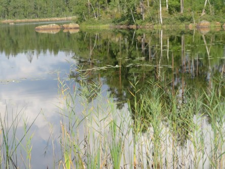
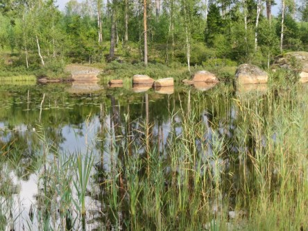
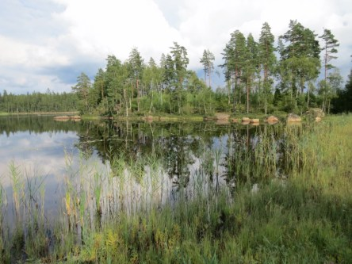
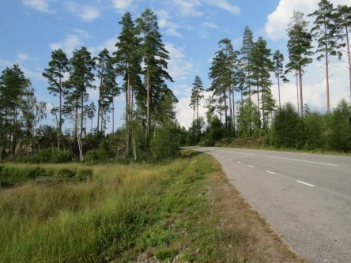
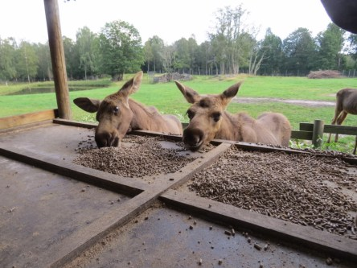

Idag går solen upp 05:44 och ned 20:21. Dagens längd är 14 timmar och 37 minuter. Det är gryning 05:02 och skymning 21:03 Det är dagsljus 16 timmar och 01 minuter. Månen går upp 18:35 och ned 01:15 Månen är belyst 83 %.

 Klart 7,4 C  Vindstilla  Luftfuktighet 95 %  hPa 1017 Kl.02:10

 Tunna moln 6,7 C  Vindby 0,3 m/s W  Luftfuktighet 99 %  hPa 1017 Kl.06:40

 Växlande molnighet 26,1 C  Vindby 4,1 m/s SW  Luftfuktighet 53 %  hPa 1016 Kl.13:05

 Växlande molnighet 17,2 C  Vindby 2,8 m/s SE  Luftfuktighet 76 %  hPa 1013 Kl.19:45

 Inget regn än!!! När kommer det som utlovats hur många gånger som helst?

Högst och lägst uppmätta temperatur igår (inofficiellt privat mätare): Max 28,5 C ( i solen ), Min 8,4 C Högst uppmätta vind 2,4 m/s. Högst uppmätta vindby 4,4 m/s

Högst och lägst uppmätta temperatur igår (officiellt enligt [YR.NO](http://www.vackertvader.se/v%C3%A4derstation/karlshamn?utm_source=email&utm_medium=email&utm_campaign=asarum)) Max 21,2 C, Min 8,6 C Högst uppmätta vind 3,8 m/s. Högst uppmätta vindby 7,1 m/s

 För några år sedan var vi på Räntemåla gård i Eringsboda och tittade på älgar. I år har de haft stängt för besökare på grund av att de bygger om hägnen där älgarna betar. Här är några bilder som jag tog på hemvägen.

 De här små trillingarna var huvudattraktionen för dagen. De var lite för upptagna med lekar och fick ofta mutas lite för att ha tid över för mat. De var inte så många veckor här, men fulla av lek.
