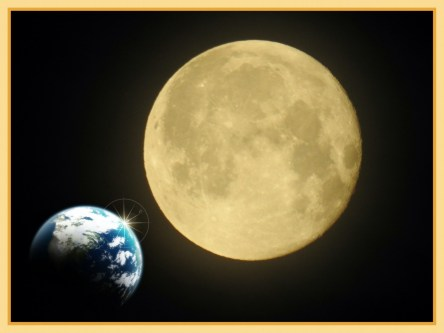
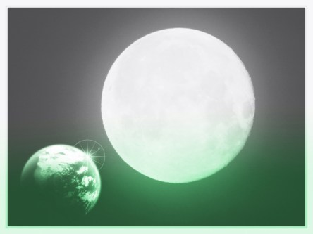
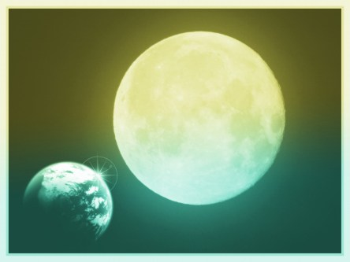
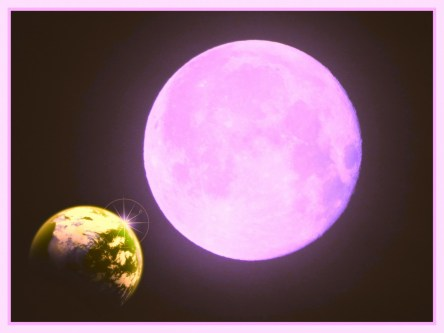
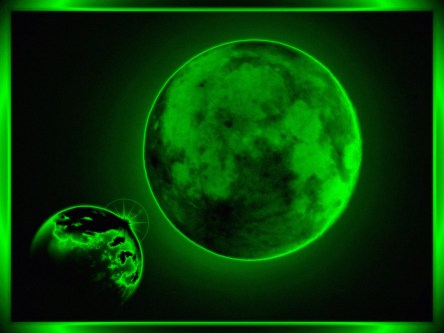

Idag går solen upp 07:49 och ned 17:40. Dagens längd är 9 timmar och 51 minuter. Det är gryning 07:10 och skymning 18:19 Det är dagsljus 11 timmar och 09 minuter. Månen går upp 17:55 och ned 05:35 Månen är belyst 97 %.

 Regn 5,5 C  Vindby 1,6 m/s SSW  Luftfuktighet 83 %  hPa 1009  Regn 0,3 mm Kl.02:05

 Regn 8,6 C  Vindby 5,4 m/s S  Luftfuktighet 91 %  hPa 996  Regn 4,5 mm Kl.07:05

 Växlande molnighet 14,3 C   Vindby 3 m/s WSW  Luftfuktighet 62 %  hPa 990  Regn 9,5 mm Kl.14:05

 Växlande molnighet 5,5 C  Vindby 1,4 m/s WNW  Luftfuktighet 82 %  hPa 991 Kl.21:00

 Det kom äntligen lite regn inatt! Men vad händer sen? Jo solen kommer fram igen och med hjälp av blåsten så torkade hon noga upp varenda droppe som kommit!

Högst och lägst uppmätta temperatur igår (inofficiellt privat mätare): Max 16,8 C , Min 4,8 C Högst uppmätta vind 4,1 m/s, Högst uppmätta vindby 6,8 m/s

Högst och lägst uppmätta temperatur igår (officiellt enligt [YR.NO](http://www.vackertvader.se/v%C3%A4derstation/karlshamn?utm_source=email&utm_medium=email&utm_campaign=asarum)) Max 12,6 C, Min 6,5 C Högst uppmätta vind 5,1 m/s. Högst uppmätta vindby 12,8 m/s

 Jag tog en av mina bilder på månen och försökte mig på lite att göra en fantasibild av den. Sen "klädde" jag den i olika färger och stilar och det här blev resultatet.
