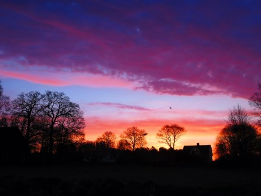
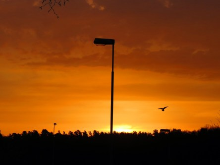

Idag går solen upp 05:35 och ned 20:23. Månen går upp 11:51 och ned 03:23 Månen är belyst 52 %. Dagens längd är 14 timmar och 48 minuter

 Mest klart 0,7 C  Vindby 0,4 m/s NE  Luftfuktighet 97 %  hPa 1009 Kl.01:55

 Mest molnigt 5,4 C  Vindby 2,6 m/s ENE  Luftfuktighet 94 %  hPa 1004 Kl.06:50

 Mest molnigt 17,1 C   Vindby 1,2 m/s E  Luftfuktighet 74 %  hPa 1001  Regn 3,8 mm Kl.13:05

 Växlande molnighet 10 C   Vindby 1 m/s NW  Luftfuktighet 68 %  hPa 1003 Kl.20:45

 En del regn och moln men även sol idag.

Högst och lägst uppmätta temperatur igår (inofficiellt privat mätare): Max 25,4 C , Min 0,9 C Högst uppmätta vind 2,4 m/s. Högst uppmätta vindby 3,7 m/s.

Högst och lägst uppmätta temperatur igår (officiellt enligt [YR.NO](http://www.vackertvader.se/v%C3%A4derstation/karlshamn?utm_source=email&utm_medium=email&utm_campaign=asarum)) Max 15,6 C, Min 0,4 C Högst uppmätta vind 3,3 m/s. Högst uppmätta vindby 6,7 m/s

 Idag var det en väldigt färgskiftande soluppgång med mörka moln och solen som tittar fram mellan dem.
