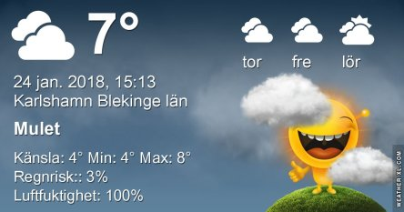

Idag går solen upp 08:11 och ned 16:15. Månen går upp 11:01 och ned 00:55 Månen är belyst 41 %. Dagens längd är 8 timmar och 4 minuter

 Regn 3 C  Vindby 3,8 m/s SE  Luftfuktighet 99 %  hPa 1005  Regn 1,8 mm Kl.01:50

 Molnigt 6 C  Vindby 2,6 m/s ENE  Luftfuktighet 98 %  hPa 1003  Regn 5,5 mm Kl.07:20

 Molnigt 7,7 C  Vindby 3 m/s NE  Luftfuktighet 92 %  hPa 1001 Kl.14:25

 Molnigt och blåsigt 6,8 C  Vindby 5,6 m/s NW  Luftfuktighet 95 %  hPa 998 Kl.19:55

 Varmt och blåsigt och regn.

Högst och lägst uppmätta temperatur igår (inofficiellt privat mätare): Max 2,7 C , Min – 1,9 C Högst uppmätta vind 3,7 m/s. Högst uppmätta vindby 6,5 m/s.

Högst och lägst uppmätta temperatur igår (officiellt enligt [YR.NO](http://www.vackertvader.se/v%C3%A4derstation/karlshamn?utm_source=email&utm_medium=email&utm_campaign=asarum)) Max 2,8 C, Min – 2,7 C Högst uppmätta vind 3,8 m/s. Högst uppmätta vindby 9,5 m/s

 I brist på solnedgångar och sol överhuvudtaget så väljer jag ett par gamla bilder på en fantastisk solnedgång.
