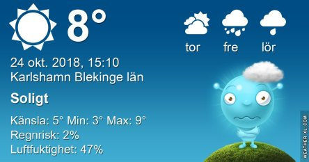
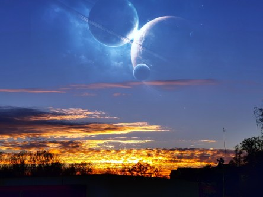
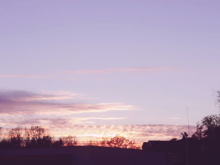
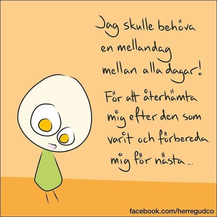

Idag går solen upp 07:51 och ned 17:38. Dagens längd är 9 timmar och 47 minuter. Det är gryning 07:12 och skymning 18:17 Det är dagsljus 11 timmar och 05 minuter. Månen går upp 18:13 och ned 06:52 Månen är belyst 100 %.

 Mest klart och blåsigt 2,6 C  Vindby 5,2 m/s S  Luftfuktighet 81 %  hPa 996 Kl.02:00

 Halvklart 1 C  Vindby 2,6 m/s W  Luftfuktighet 66 %  hPa 1001 Kl.07:50

 Klart 12 C  Vindby 4,1 m/s S  Luftfuktighet 37 %  hPa 1006 Kl.14:00

 Växlande molnighet 0,9 C  Vindby 0,8 m/s ENE  Luftfuktighet 67 %  hPa 1007 Kl.19:50

 Nu har hösten kommit på allvar med kallt både dag och natt.

Högst och lägst uppmätta temperatur igår (inofficiellt privat mätare): Max 18 C , Min 2,7 C Högst uppmätta vind 4,1 m/s, Högst uppmätta vindby 6,5 m/s

Högst och lägst uppmätta temperatur igår (officiellt enligt [YR.NO](http://www.vackertvader.se/v%C3%A4derstation/karlshamn?utm_source=email&utm_medium=email&utm_campaign=asarum)) Max 12,8 C, Min 4 C Högst uppmätta vind 4,8 m/s. Högst uppmätta vindby 12,7 m/s

 Dagens solnedgång i olika skepnader.

 Och några kloka och roliga ord igen.
