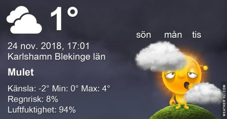

Idag går solen upp 07:56 och ned 15:38 Dagens längd är 7 timmar och 42 minuter. Det är gryning 07:11 och skymning 16:23 Det är dagsljus 9 timmar och 12 minuter. Månen går upp 17:03 och ned 08:48 Månen är belyst 99 %.

 Regn 0,8 C  Vindby 0,8 m/s N  Luftfuktighet 88 %  hPa 1013  Regn 1 mm Kl.02:00

 Molnigt 1,1 C  Vindby 0,3 m/s NW  Luftfuktighet 88 %  hPa 1011 Kl.07:10

 Molnigt 3,6 C  Vindby 1,2 m/s N  Luftfuktighet 90 %  hPa 1011 Kl.13:50

 Duggregn - 0,4 C  Vindby 1,4 m/s WNW  Luftfuktighet 88 %  hPa 1013 Kl.20:35

 Ännu en grå och kall dag är till ända.

Högst och lägst uppmätta temperatur igår (inofficiellt privat mätare): Max 3,3 C , Min 0,4 C Högst uppmätta vind 3,4 m/s, Högst uppmätta vindby 4,1 m/s

Högst och lägst uppmätta temperatur igår (officiellt enligt [YR.NO](http://www.vackertvader.se/v%C3%A4derstation/karlshamn?utm_source=email&utm_medium=email&utm_campaign=asarum)) Max 3,4 C, Min 1 C Högst uppmätta vind 2,6 m/s. Högst uppmätta vindby 5,2 m/s

\[gallery type="rectangular" link="file" size="medium" ids="25257,24578,24576,24256,24255,23983,23967,23928,23855,23575,23448,23383"\]

Just nu är allt så grått och trist att jag kände ett stort behov av sol och färg. Så här har jag plocket ihop lite olika soluppgångar att minnas.
