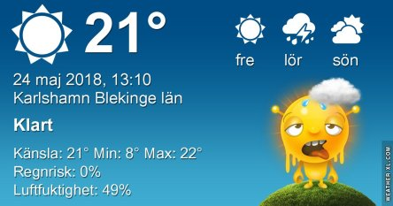

Idag går solen upp 04:32 och ned 21:23. Månen går upp 14:57 och ned 03:16 Månen är belyst 71 %. Dagens längd är 16 timmar och 51 minuter

 Klart 6,7 C  Vindstilla  Luftfuktighet 99 %  hPa 1023 Kl.01:45

 Klart 16,5 C  Vindby 0,6 m/s SSW  Luftfuktighet 66 %  hPa 1024 Kl.07:20

 Mest klart 28,1 C  Vindby 2 m/s ESE  Luftfuktighet 47 %  hPa 1025 Kl.13:25

 Klart 15,9 C  Vindby 3 m/s ESE  Luftfuktighet 61 %  hPa 1023 Kl.20:10

 Ännu en torr och varm dag utan minsta tecken på regn.

Högst och lägst uppmätta temperatur igår (inofficiellt privat mätare): Max 28,6 C ( i solen) , Min 5 C Högst uppmätta vind 2 m/s. Högst uppmätta vindby 5,8 m/s.

Högst och lägst uppmätta temperatur igår (officiellt enligt [YR.NO](http://www.vackertvader.se/v%C3%A4derstation/karlshamn?utm_source=email&utm_medium=email&utm_campaign=asarum)) Max 21,3 C, Min 4,3 C Högst uppmätta vind 3,5 m/s. Högst uppmätta vindby 6,5 m/s

 Några arkivbilder från tidiga morgnar i Asarum
