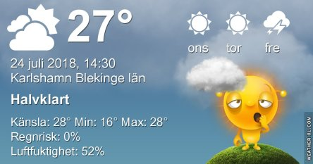
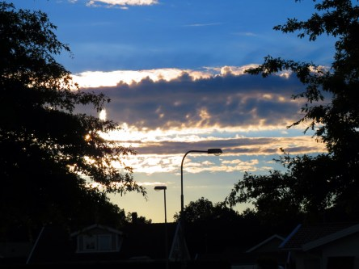

Idag går solen upp 04:49 och ned 21:24. Dagens längd är 16 timmar och 35 minuter. Det är gryning 03:56 och skymning 22:17 Det är dagsljus 18 timmar och 21 minuter. Månen går upp 18:56 och ned 01:55 Månen är belyst 88 %.

 Klart 13,7 C  Vindstilla  Luftfuktighet 92 %  hPa 1011 Kl.02:05

 Växlande molnighet 15,3 C  Vindstilla  Luftfuktighet 94 %  hPa 1011 Kl.06:30

 Växlande molnighet och varmt 35,7 C   Vindby 1,8 m/s NNW  Luftfuktighet 36 %  hPa 1010 Kl.13:25

 Tunna moln 22,9 C  Vindby 0,3 m/s SW  Luftfuktighet 66 %  hPa 1009 Kl.21:00

 Jag står inte ut en dag till!!!!

Högst och lägst uppmätta temperatur igår (inofficiellt privat mätare): Max 28,7 C ( i solen ), Min 10,5 C Högst uppmätta vind 3,7  m/s. Högst uppmätta vindby 5,4 m/s

Högst och lägst uppmätta temperatur igår (officiellt enligt [YR.NO](http://www.vackertvader.se/v%C3%A4derstation/karlshamn?utm_source=email&utm_medium=email&utm_campaign=asarum)) Max 26 C, Min 10,3 C Högst uppmätta vind 3,6 m/s. Högst uppmätta vindby 7,4 m/s

 Den här lilla entitan sjöng för mig från grannens träd. Ingen bra bild precis eftersom det är långt zoomat. Men den är värd att ta med ändå tycker jag.

 Trots molnens försök att stoppa henne så vann hon igen. Suck.
