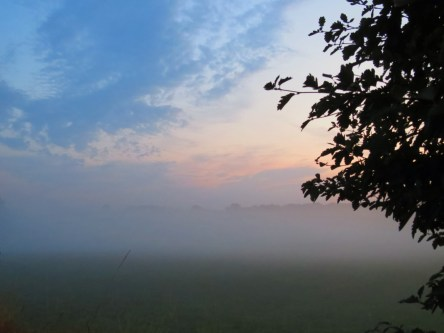

Idag går solen upp 05:48 och ned 20:16. Dagens längd är 14 timmar och 28 minuter. Det är gryning 05:07 och skymning 20:57 Det är dagsljus 15 timmar och 50 minuter. Månen går upp 19:47 och ned 03:03 Månen är belyst 95 %.

 Mest klart 11,9 C  Vindby 0,3 m/s W  Luftfuktighet 97 %  hPa 1002 Kl.02:20

 Slöjmoln och disigt 11,4 C  Vindstilla  Luftfuktighet 99 %  hPa 1000 Kl.06:50

 Mest molnigt 28,3 C  Vindby 4,4 m/s SSW  Luftfuktighet 66 %  hPa 999 Kl.13:00

 Växlande molnighet 15,4 C  Vindby 2 m/s N  Luftfuktighet 61 %  hPa 1001 Kl.19:45

 Ännu en varm dag med mörka moln som inte vill släppa ifrån sig något av sitt innehåll.

Högst och lägst uppmätta temperatur igår (inofficiellt privat mätare): Max 31,8 C ( i solen ), Min 9,4 C Högst uppmätta vind 2 m/s. Högst uppmätta vindby 4,4 m/s

Högst och lägst uppmätta temperatur igår (officiellt enligt [YR.NO](http://www.vackertvader.se/v%C3%A4derstation/karlshamn?utm_source=email&utm_medium=email&utm_campaign=asarum)) Max 25 C, Min 8,9 C Högst uppmätta vind 3,3 m/s. Högst uppmätta vindby 7,1 m/s

 En sval och skön morgon med pastellfärger och dimma...

 övergick i sol och värme igen.
