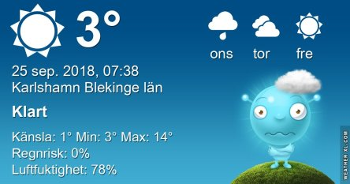
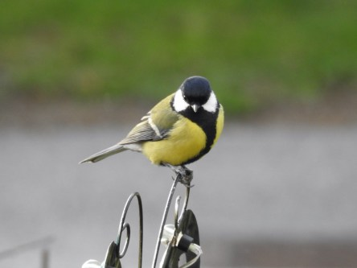
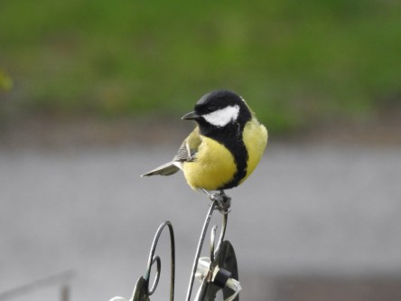
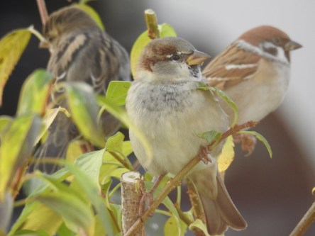
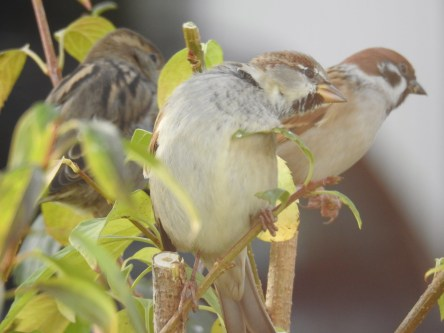
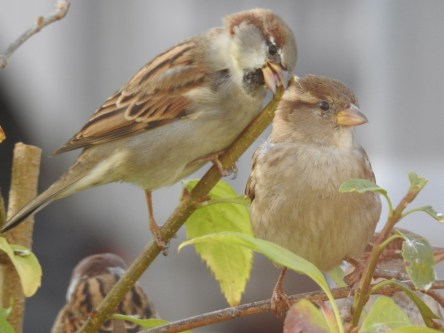
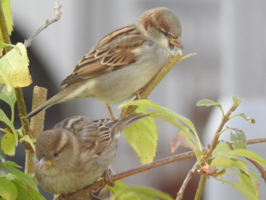

Idag går solen upp 06:51 och ned 18:52. Dagens längd är 12 timmar och 01 minuter. Det är gryning 06:14 och skymning 19:29 Det är dagsljus 13 timmar och 15 minuter. Månen går upp 19:33 och ned 06:39 Månen är belyst 100 %.

 Klart - 0,9 C  Vindby 0,3 m/s SW  Luftfuktighet 88 %  hPa 1022 Kl.01:15

 Växlande molnighet - 1,8 C  Vindstilla  Luftfuktighet 98 %  hPa 1026 Kl.07:30

 Klart 19,3 C  Vindby 2,4 m/s NW  Luftfuktighet 23 %  hPa 1028 Kl.14:05

 Klart 6,6 C  Vindby 0,3 m/s SW  Luftfuktighet 67 %  hPa 1028 Kl.19:55

 Hu! Inatt var det riktigt kallt. Höstens första frysnatt!

Högst och lägst uppmätta temperatur igår (inofficiellt privat mätare): Max 18,3 C , Min 0,3 C Högst uppmätta vind 2,7 m/s. Högst uppmätta vindby 5,1 m/s

Högst och lägst uppmätta temperatur igår (officiellt enligt [YR.NO](http://www.vackertvader.se/v%C3%A4derstation/karlshamn?utm_source=email&utm_medium=email&utm_campaign=asarum)) Max 13,7 C, Min 4,1 C Högst uppmätta vind 5 m/s. Högst uppmätta vindby 11,7 m/s

 Dagsfärska bilder från min fågelrestaurang utanför köksfönstret.
