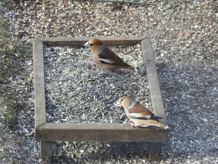
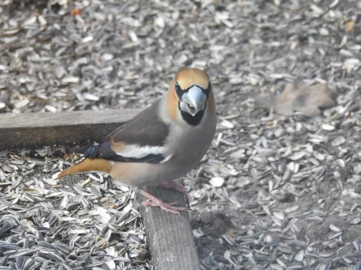

Idag går solen upp 07:03 och ned 17:25. Månen går upp 11:49 och ned 03:48 Månen är belyst 69 %. Dagens längd är 10 timmar och 22 minuter

 Mest klart och kallt - 8,9 C  Vindby 1,8 m/s NNW  Luftfuktighet 64 %  hPa 1032 Kl.01:50

 Soligt och tunna moln - 8,4 C  Vindby 1,6 m/s SSW  Luftfuktighet 70 %   hPa 1031 Kl.07:40

 Växlande molnighet 0,9 C  Vindby 6 m/s SW  Luftfuktighet 49 %  hPa 1031 Kl.13:10

 Klart och kallt - 8,7 C  Vindby 2,4 m/s E  Luftfuktighet 60 %  hPa 1032 Kl.19:50

 Trots att det står mestadels mulet så har det varit mestadels sol idag.

Högst och lägst uppmätta temperatur igår (inofficiellt privat mätare): Max 3,3 C, Min – 8,5 C Högst uppmätta vind 2,7 m/s. Högst uppmätta vindby 4,4 m/s.

Högst och lägst uppmätta temperatur igår (officiellt enligt [YR.NO](http://www.vackertvader.se/v%C3%A4derstation/karlshamn?utm_source=email&utm_medium=email&utm_campaign=asarum)) Max – 1,1 C, Min – 7,8 C Högst uppmätta vind 3,1 m/s. Högst uppmätta vindby 6,9 m/s

 Idag kom stjärtmesen på besök igen.

 Herr och fru Stenknäck.

 Herr Stenknäck funderar över livet en stund.

 Och dt gör även den lilla blåmesen.
