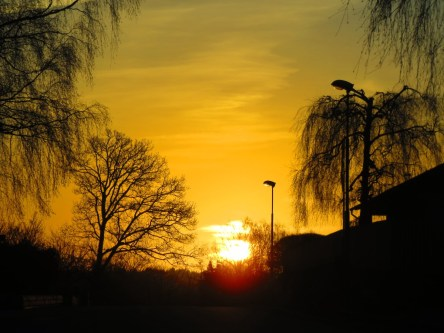

Idag går solen upp 06:50 och ned 19:23. Månen går upp 11:40 och ned 03:45 Månen är belyst 54 %. Dagens längd är 12 timmar och 33 minuter

 Molnigt 0,8 C  Vindby 0,7 m/s NW  Luftfuktighet 83 %  hPa 1002 Kl.01:40

 Molnigt 3,2 C   Vindby 0,3 m/s NW  Luftfuktighet 88 %  hPa 1001 Kl.07:50

 Molnigt 11,9 C  Vindby 2 m/s ESE  Luftfuktighet 66 %  hPa 1002 Kl.13:10

 Molnigt 4,8 C  Vindby 2 m/s WNW  Luftfuktighet 76 %  hPa 1003 Kl.19:50

 En väldigt grå dag men det var åtminstone varmt.

Högst och lägst uppmätta temperatur igår (inofficiellt privat mätare): Max 6,6 C  , Min – 1,3 C Högst uppmätta vind 2,7 m/s. Högst uppmätta vindby 4,8 m/s.

Högst och lägst uppmätta temperatur igår (officiellt enligt [YR.NO](http://www.vackertvader.se/v%C3%A4derstation/karlshamn?utm_source=email&utm_medium=email&utm_campaign=asarum)) Max 3,7 C, Min – 0,7 C Högst uppmätta vind 3,3 m/s. Högst uppmätta vindby 6,5 m/s

 Återigen får arkivet komma till användning. Här är några bilder på solnedgångar och soluppgångar från mars 2017.
