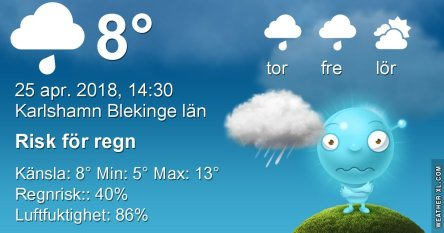
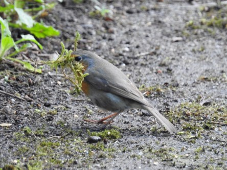
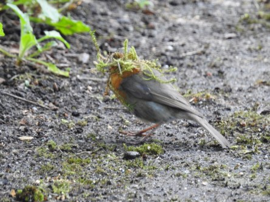
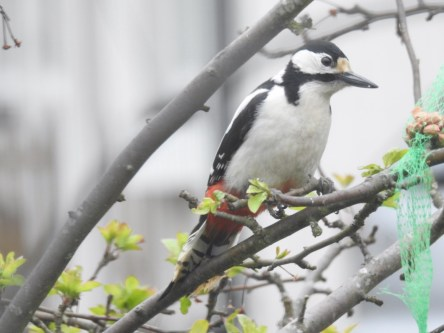

Idag går solen upp 05:30 och ned 20:27. Månen går upp 14:31 och ned 04:25 Månen är belyst 74 %. Dagens längd är 14 timmar och 57 minuter

 Växlande molnighet 5,4 C  Vindby 0,7 m/s NW  Luftfuktighet 79 %  hPa 1000 Kl.02:25

 Molnigt 5,3 C  Vindstilla  Luftfuktighet 91 %  hPa 998 Kl.06:30

 Molnigt 13,7 C  Vindby 1 m/s NW   Luftfuktighet 83 %  hPa 995  Regn 2,7 mm Kl.13:35

 Tunna moln 7,6 C  Vindby 1,4 m/s SW  Luftfuktighet 69 %  hPa 997 Kl.20:00

 Kallt, regn och sol om vartannat idag.

Högst och lägst uppmätta temperatur igår (inofficiellt privat mätare): Max 15,9 C , Min 7,4 C Högst uppmätta vind 5,4 m/s. Högst uppmätta vindby 12 m/s.

Högst och lägst uppmätta temperatur igår (officiellt enligt [YR.NO](http://www.vackertvader.se/v%C3%A4derstation/karlshamn?utm_source=email&utm_medium=email&utm_campaign=asarum)) Max 14,8 C, Min 7,6 C Högst uppmätta vind 4,8 m/s. Högst uppmätta vindby 15,5 m/s

 Den lilla rödhaken har fullt sjå med sitt bo i vattenkannan.

 Och mamma och pappa Hacke turas om att hämta mat.

 Och här är det fler som har hitta till maten. Söt är den men kanske inte helt önskvärd just här.
