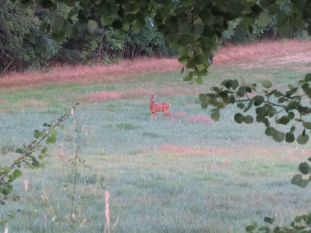

Idag går solen upp 04:50 och ned 21:23. Dagens längd är 16 timmar och 33 minuter. Det är gryning 03:58 och skymning 22:14 Det är dagsljus 18 timmar och 16 minuter. Månen går upp 19:51 och ned 02:33 Månen är belyst 88 %.

 Klart 16 C  Vindstilla  Luftfuktighet 86 %  hPa 1010 Kl.02:05

 Växlande molnighet 18,4 C  Vindby 0,6 m/s E  Luftfuktighet 76 %  hPa 1011 Kl.06:35

 Klart 33,6 C  Vindby 3,8 m/s SSW  Luftfuktighet 45 %  hPa 1012 Kl.14:05

 Mest klart 23,1 C  Vindby 1,6 m/s SE  Luftfuktighet 81 %  hPa 1012 Kl.19:55

 Usch vilken sommar vi har. Normalt sett vill man ha sol och inte regn på sommaren. Men nu är det precis tvärt om. Man vill att regnet ska ösa ner i veckor utan uppehåll! Jag går gärna ut och blir genomblöt nu.

Högst och lägst uppmätta temperatur igår (inofficiellt privat mätare): Max 36,3 C ( i solen ), Min 13,2 C Högst uppmätta vind 2,4 m/s. Högst uppmätta vindby 3,7 m/s

Högst och lägst uppmätta temperatur igår (officiellt enligt [YR.NO](http://www.vackertvader.se/v%C3%A4derstation/karlshamn?utm_source=email&utm_medium=email&utm_campaign=asarum)) Max 29,8 C, Min 13,3 C Högst uppmätta vind 3,5 m/s. Högst uppmätta vindby 8,3 m/s

 "Mitt" rådjur har koll på mig.

 Grågässen invaderar åkrarna i jakt på lite mat.
