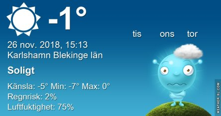

Idag går solen upp 08:00 och ned 15:36 Dagens längd är 7 timmar och 36 minuter. Det är gryning 07:15 och skymning 16:21 Det är dagsljus 9 timmar och 6 minuter. Månen går upp 18:58 och ned 11:07 Månen är belyst 90 %.

 Klart - 4,9 C  Vindby 0,3 m/s W  Luftfuktighet 83 %  hPa 1014 Kl.02:00

 Klart - 7,8 C   Vindstilla  Luftfuktighet 83 %  hPa 1014 Kl.06:25

 Mest klart 4,6 C  Vindby 1,2 m/s WNW  Luftfuktighet 55 %  hPa 1014 Kl.13:40

 Klart - 7,6 C  Vindby 0,3 m/s SW  Luftfuktighet 81 %  hPa 1014 Kl.20:25

 Nu är det riktigt kallt och vinterlikt ute.

Högst och lägst uppmätta temperatur igår (inofficiellt privat mätare): Max 6,2 C , Min – 3,9 C Högst uppmätta vind 2,4 m/s, Högst uppmätta vindby 4,4 m/s

Högst och lägst uppmätta temperatur igår (officiellt enligt [YR.NO](http://www.vackertvader.se/v%C3%A4derstation/karlshamn?utm_source=email&utm_medium=email&utm_campaign=asarum)) Max 2,9 C, Min – 3,8 C Högst uppmätta vind 2,4 m/s. Högst uppmätta vindby 6,1 m/s

 Mörkt och grått och kallt! Hu!

 Spöklikt, mörkt och kallt.

