Idag går solen upp 07:01 och ned 17:27. Månen går upp 12:51 och ned 04:50 Månen är belyst 79 %. Dagens längd är 10 timmar och 26 minuter

 Växlande molnighet - 8,1 C  Vindby 1,6 m/s WSW  Luftfuktighet 75 %  hPa 1030 Kl.02:25

 Växlande molnighet och lite snö - 8,6 C  Vindby 2,8 m/s SW  Luftfuktighet 74 %  hPa 1029 Kl.06:35

 Blåsigt 0 C  Vindby 8 m/s SSW  Luftfuktighet 51 %  hPa 1027 Kl.13:25

 Klart - 6,4 C  Vindby 3,7 m/s NE  Luftfuktighet 57 %  hPa 1026 Kl.19:45

[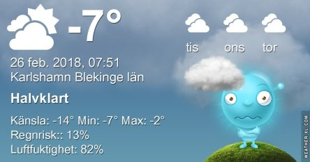](https://worldwideweatherblog.wordpress.com/wp-content/uploads/2018/02/weatherxl-1519627928575.jpg) Kallt och blåsigt men åtminstone lite sol.

Högst och lägst uppmätta temperatur igår (inofficiellt privat mätare): Max 2,1 C ( i solen ), Min – 9,4 C Högst uppmätta vind 2,7 m/s. Högst uppmätta vindby 9,4 m/s.

Högst och lägst uppmätta temperatur igår (officiellt enligt [YR.NO](http://www.vackertvader.se/v%C3%A4derstation/karlshamn?utm_source=email&utm_medium=email&utm_campaign=asarum)) Max – 2,2 C, Min – 8,1 C Högst uppmätta vind 3,8 m/s. Högst uppmätta vindby 9,5 m/s

[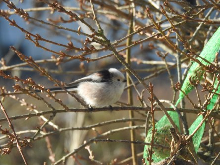](https://worldwideweatherblog.wordpress.com/wp-content/uploads/2018/02/dscn1695-1600x1200.jpg)

[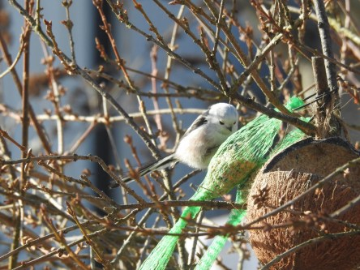](https://worldwideweatherblog.wordpress.com/wp-content/uploads/2018/02/dscn1694-1600x1200.jpg)

 Stjärtmesar på besök idag.

[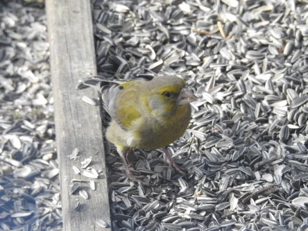](https://worldwideweatherblog.wordpress.com/wp-content/uploads/2018/02/dscn1657-1600x1200.jpg)

[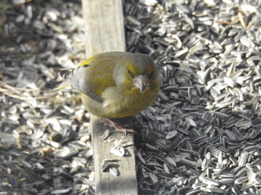](https://worldwideweatherblog.wordpress.com/wp-content/uploads/2018/02/dscn1644-1600x1200.jpg)

 Grönfinken behagade hälsa på idag också. Det var längesedan sist.

[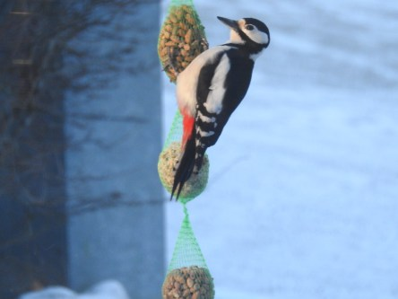](https://worldwideweatherblog.wordpress.com/wp-content/uploads/2018/02/dscn1556-1600x1200.jpg)

[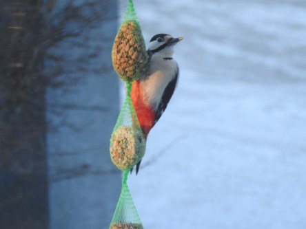](https://worldwideweatherblog.wordpress.com/wp-content/uploads/2018/02/dscn1558-1600x1200.jpg) Även mamma Hacke kom idag också.

[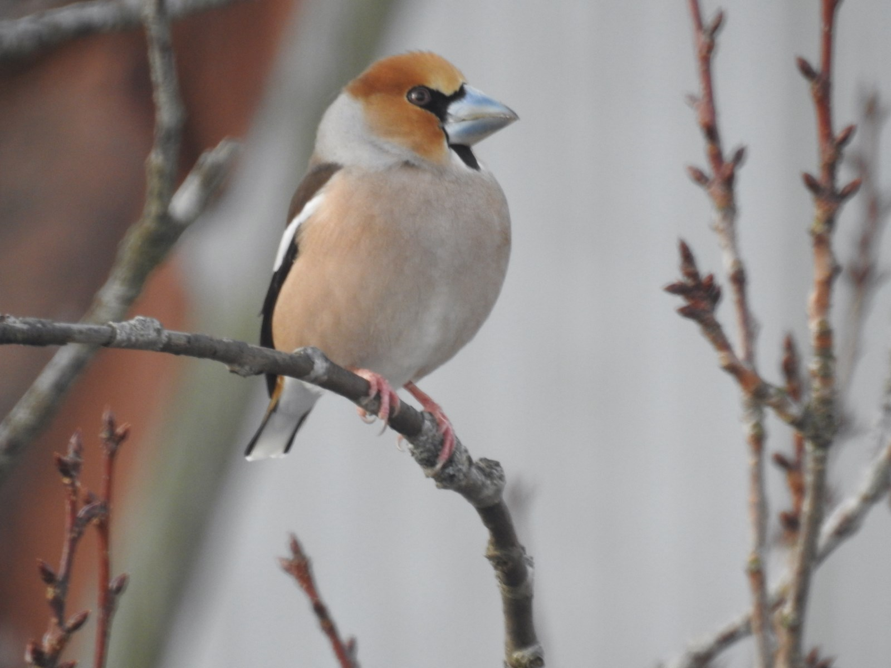](https://worldwideweatherblog.wordpress.com/wp-content/uploads/2018/02/dscn1592-1600x1200.jpg)

[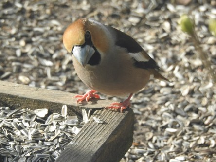](https://worldwideweatherblog.wordpress.com/wp-content/uploads/2018/02/dscn1615-1600x1200.jpg)

[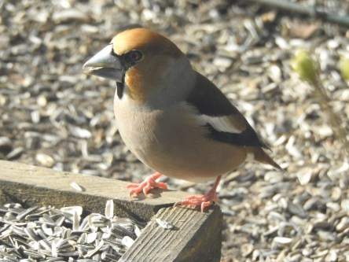](https://worldwideweatherblog.wordpress.com/wp-content/uploads/2018/02/dscn1617-1600x1200.jpg)

[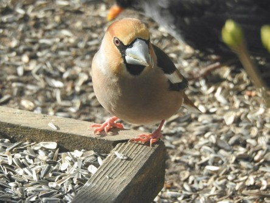](https://worldwideweatherblog.wordpress.com/wp-content/uploads/2018/02/dscn1620-1600x1200.jpg)

 Och sist men inte minst: Mina dagliga stenknäckar.
