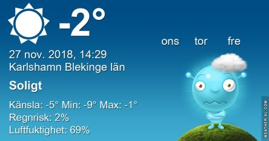

Idag går solen upp 08:01 och ned 15:35 Dagens längd är 7 timmar och 34 minuter. Det är gryning 07:16 och skymning 16:20 Det är dagsljus 9 timmar och 4 minuter. Månen går upp 20:14 och ned 11:57 Månen är belyst 81 %.

 Klart - 9,7 C   Vindby 0,3 m/s SW  Luftfuktighet 76 %  hPa 1016 Kl.02:20

 Klart - 10,3 C  Vindstilla  Luftfuktighet 77 %  hPa 1017 KL.07:00

 Klart 2,7 C  Vindby 2 m/s S  Luftfuktighet 49 %  hPa 1021 Kl.14:10

 Klart - 10,3  Vindby 0,3 m/s W  Luftfuktighet 72 %  hPa 1023 Kl.19:50

 Nu är det riktigt kallt både natt och dag. Men snart blir det mildare igen.

Högst och lägst uppmätta temperatur igår (inofficiellt privat mätare): Max 5,7 C , Min – 9,1 C Högst uppmätta vind 1 m/s, Högst uppmätta vindby 1,7 m/s

Högst och lägst uppmätta temperatur igår (officiellt enligt [YR.NO](http://www.vackertvader.se/v%C3%A4derstation/karlshamn?utm_source=email&utm_medium=email&utm_campaign=asarum)) Max 0,4 C, Min – 8,9 C Högst uppmätta vind 2 m/s. Högst uppmätta vindby 4 m/s

\[gallery type="rectangular" size="medium" link="file" ids="25653,25651,25650,25649,25648"\]

Lite lek med att blanda bilder med varandra fick det här resultatet.

 Det här gäller de som helt plötsligt har börjat motsätta sig att vi ska skippa klockomställningen så att det har blivit uppskjutet till Mars 2021 istället för Mars 2019 😩👎
