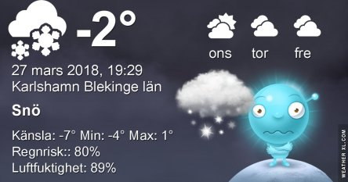
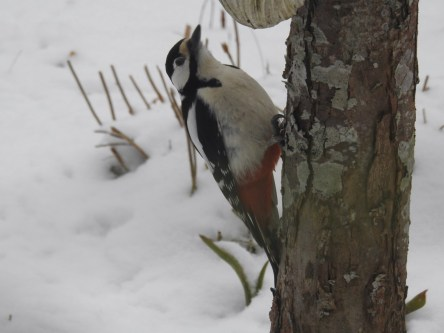
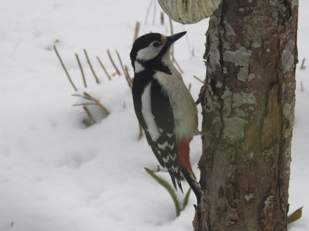
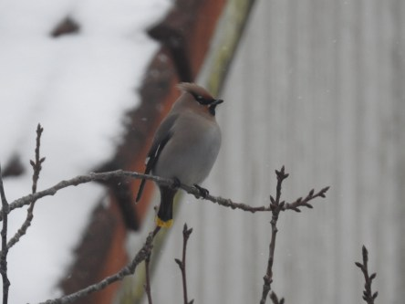
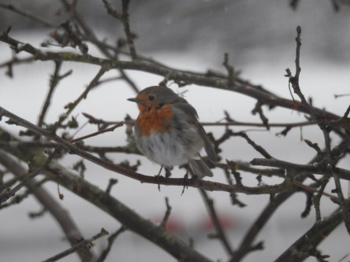
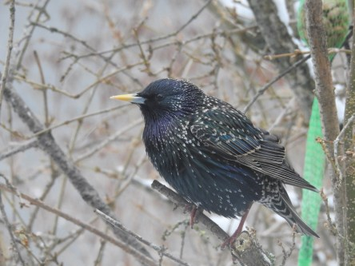
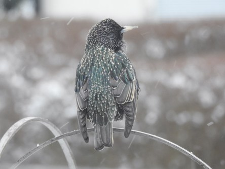
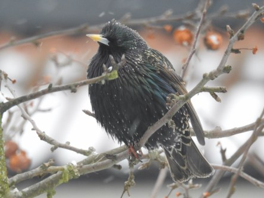

Idag går solen upp 06:45 och ned 19:28. Månen går upp 14:04 och ned 05:20 Månen är belyst 77 %. Dagens längd är 12 timmar och 43 minuter

 Molnigt och en del snö - 3,5 C  Vindby 2 m/s SSW  Luftfuktighet 74 %  Pa 1013 KL.02:20

 Snö - 3,4 C  Vindby 0,8 m/s N  Luftfuktighet 81 %  hPa 1013 Kl.06:45

 Snö 2,1 C  Vindby 4 m/s SSW  Luftfuktighet 88 %  hPa 1013 Kl.13:10

 Lätt snö - 3,9 C  Vindby 2,2 m/s S  Luftfuktighet 81 %  hPa 1013  Snödjup ca 3 cm Kl.19:55

 Snö och vinter igen. Och kallt.

Högst och lägst uppmätta temperatur igår (inofficiellt privat mätare): Max 6,1 C  , Min - 2,2 C Högst uppmätta vind 1,7 m/s. Högst uppmätta vindby 3,4 m/s.

Högst och lägst uppmätta temperatur igår (officiellt enligt [YR.NO](http://www.vackertvader.se/v%C3%A4derstation/karlshamn?utm_source=email&utm_medium=email&utm_campaign=asarum)) Max 3,7 C, Min - 2,1 C Högst uppmätta vind 2,9 m/s. Högst uppmätta vindby 6,1 m/s

 Ett litet urval bland mina matgäster idag. Hackspett, Sidensvans, rödhake och stare.
