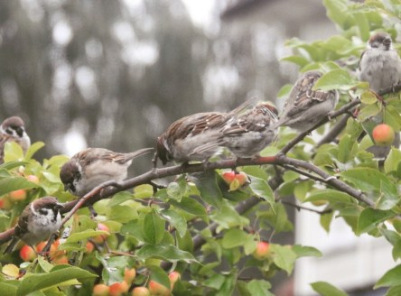
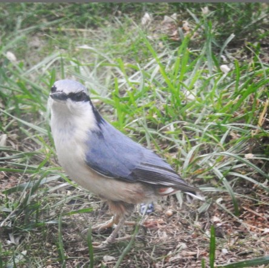

Idag går solen upp 05:54 och ned 20:09. Dagens längd är 14 timmar och 15 minuter. Det är gryning 05:13 och skymning 20:49 Det är dagsljus 15 timmar och 36 minuter. Månen går upp 20:54 och ned 06:27 Månen är belyst 100 %.

 Mest molnigt 5,9 C  Vindstilla  Luftfuktighet 99 %  hPa 1009 Kl.02:15

 Mest molnigt 7,4 C  Vindstilla  Luftfuktighet 99 %  hPa 1008 Kl.06:40

 Molnigt 18,9 C  Vindby 4 m/s SSW  Luftfuktighet 63 %  hPa 1005  Regn 1,2 mm Kl.13:30

 Molnigt 13,3 C  Vindby 3 m/(s NNW  Luftfuktighet 97 %  hPa 1004  Regn 2,7 mm Kl.19:45

 Idag har det varit svalt och kommit lite regn. Med betoning på lite än så länge.

Högst och lägst uppmätta temperatur igår (inofficiellt privat mätare): Max 25,6 C ( i solen ), Min 4,2 C Högst uppmätta vind 4,1 m/s. Högst uppmätta vindby 6,5 m/s

Högst och lägst uppmätta temperatur igår (officiellt enligt [YR.NO](http://www.vackertvader.se/v%C3%A4derstation/karlshamn?utm_source=email&utm_medium=email&utm_campaign=asarum)) Max 19,6 C, Min 4 C Högst uppmätta vind 3,9 m/s. Högst uppmätta vindby 8,4 m/s

 Några av gästerna i trädgården idag.
