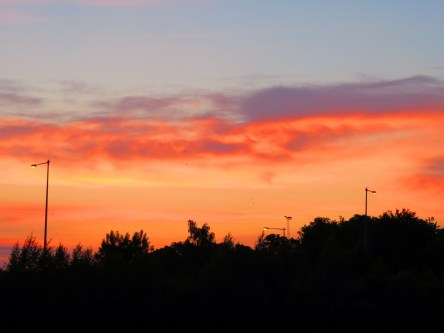

Idag går solen upp 04:26 och ned 21:30. Månen går upp 19:56 och ned 04:32 Månen är belyst 98 %. Dagens längd är 17 timmar och 4 minuter

 Växlande molnighet 11,9 C  Vindby 2,4 m/s NE  Luftfuktighet 71 %  hPa 1022 Kl.01:50

 Växlande molnighet 16,5 C  Vindby 1,6 m/s NE  Luftfuktighet 66 %  hPa 1021 Kl.07:00

 Tunna slöjmoln 28,6 C  Vindby 3,4 m/s E  Luftfuktighet 48 %  hPa 1021 Kl.13:05

 Tunna slöjmoln 22,5 C  Vindby 3,1 m/s S  Luftfuktighet 57 %  hPa 1021 Kl.19:50

 Idag känner jag mig ungefär lika bränd som figuren i prognosen: Det har varit olidligt varmt idag.

Högst och lägst uppmätta temperatur igår (inofficiellt privat mätare): Max 24,2 C , Min 10,9 C Högst uppmätta vind 3,4 m/s. Högst uppmätta vindby 5,8 m/s

Högst och lägst uppmätta temperatur igår (officiellt enligt [YR.NO](http://www.vackertvader.se/v%C3%A4derstation/karlshamn?utm_source=email&utm_medium=email&utm_campaign=asarum)) Max 22,6 C, Min 10 C Högst uppmätta vind 3,1 m/s. Högst uppmätta vindby 8,3 m/s

 Här gör solen sig redo för att steka oss hela dagen igen.
