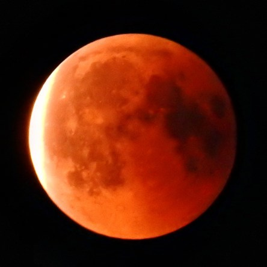
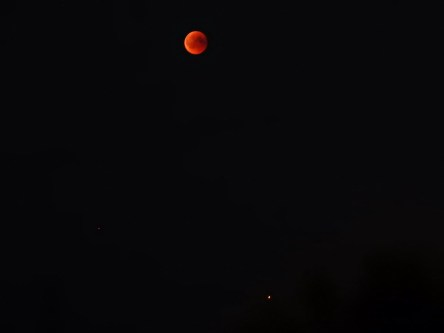
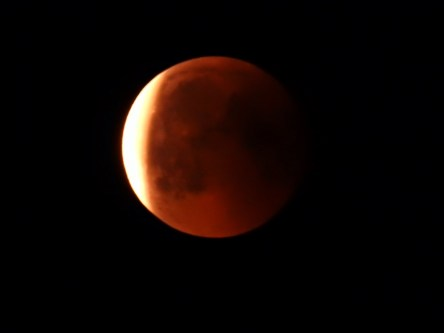
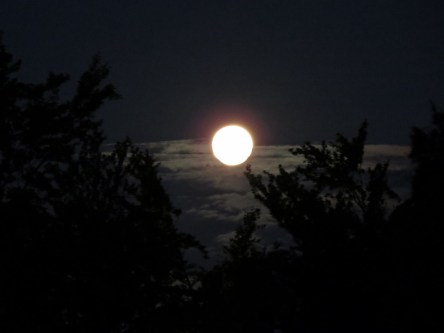
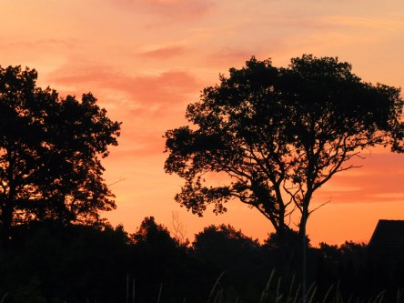

Idag går solen upp 04:56 och ned 21:17. Dagens längd är 16 timmar och 21 minuter. Det är gryning 04:05 och skymning 22:07 Det är dagsljus 18 timmar och 02 minuter. Månen går upp 21:45 och ned 05:12 Månen är belyst 100 %.

 Klart 18,8 C  Vindby 1,8 m/s E  Luftfuktighet 82 %  hPa 1012 Kl.02:35

 Mest molnigt 20,4 C  Vindby 2,4 m/s W  Luftfuktighet 89 %  hPa 1010 Kl.06:35

 Halvklart 32,4 C  Vindby 3,8 m/s N  Luftfuktighet 54 %  hPa 1007 Kl.14:30

 Tunna slöjmoln 24,7 C  Vindby 1,8 m/s NE  Luftfuktighet 74 %  hPa 1006 Kl.19:50

 Nu börjar jag tappa tålamodet med det här vädret. Och med alla prognoser som hela tiden utlovar både åska och regn som aldrig kommer.

Högst och lägst uppmätta temperatur igår (inofficiellt privat mätare): Max 35,5 C ( i solen ), Min 15,8 C Högst uppmätta vind 3,4 m/s. Högst uppmätta vindby 5,8 m/s

Högst och lägst uppmätta temperatur igår (officiellt enligt [YR.NO](http://www.vackertvader.se/v%C3%A4derstation/karlshamn?utm_source=email&utm_medium=email&utm_campaign=asarum)) Max 30,2 C, Min 14 C Högst uppmätta vind 6 m/s. Högst uppmätta vindby 11,4 m/s

 Jag lyckades inte få några bra bilder på blodmånen där jag stod inatt, men min son Johannes klättrade upp på taket med kamera och stativ och lyckades få de här bilderna på fenomenet i skyn. På bild nummer två ser man både månen och mars som en liten prick längst ner till höger.

 Lite senare fick även jag några bilder på månen, men då var det ingen blodmåne längre. Först lyste den ganska skarpt vitt och sen blev den nästan gul.

 En stund senare så såg det ut så här på himlen.
