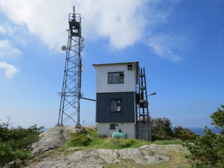

Idag går solen upp 05:56 och ned 20:06. Dagens längd är 14 timmar och 10 minuter. Det är gryning 05:16 och skymning 20:46 Det är dagsljus 15 timmar och 30 minuter. Månen går upp 21:11 och ned 07:39 Månen är belyst 98 %.

 Molnigt 11,3 C  Vindstilla  Luftfuktighet 97 %    hPa 1006 Kl.02:30

 Molnigt 12,3 C  Vindby 0,3 m/s E  Luftfuktighet 99 %  hPa 1008 Kl.06:55

 Mest molnigt 21,9 C  Vindby 2,4 m/s E  Luftfuktighet 73 %  hPa 1012  Regn 0,5 mm Kl.14:00

 Mest molnigt 14,5 C  Vindstilla  Luftfuktighet 86 %  hPa 1014 Kl.21:00

 Idag har det varit riktigt behagligt med kring 20 grader och mest molnigt med lite sol emellan. Men som vanligt inget regn att tala om, ynka 0,5 mm än så länge.

Högst och lägst uppmätta temperatur igår (inofficiellt privat mätare): Max 18,7 C , Min 5,9 C Högst uppmätta vind 2,7 m/s. Högst uppmätta vindby 4,8 m/s

Högst och lägst uppmätta temperatur igår (officiellt enligt [YR.NO](http://www.vackertvader.se/v%C3%A4derstation/karlshamn?utm_source=email&utm_medium=email&utm_campaign=asarum)) Max 17,8 C, Min 6,3 C Högst uppmätta vind 3,4 m/s. Högst uppmätta vindby 11,3 m/s

 I brist på ork och nya motiv så fick arkivet rycka in idag. Här är några utsiktsbilder från ön Marstrand när vi var där 2016. Det är en mycket mysig liten ö som jag har många härliga barndomsminnen ifrån när jag var hos mina släktingar i Göteborg.
