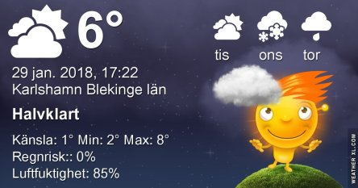

Idag går solen upp 08:02 och ned 16:25. Månen går upp 14:03 och ned 06:03 Månen är belyst 91 %. Dagens längd är 8 timmar och 23 minuter

 Mest molnigt 4,5 C  Vindby 4,4 m/s WNW  Luftfuktighet 77 %  hPa 1007 Kl.01:30

 Molnigt 3,9 C  Vindstilla  Luftfuktighet 89 %  hPa 1003 Kl.06:55

 Molnigt 8,6 C  Vindby 5,1 m/s NE  Luftfuktighet 93 %  hPa 995  Regn 5,5 mm Kl.13:20

 Molnigt 3,7 C  Vindby 4 m/s NNW  Luftfuktighet 85 %  hPa 998 Kl.19:45

 Ännu en ruggigt blåsig dag som gått i grått.

Högst och lägst uppmätta temperatur igår (inofficiellt privat mätare): Max 7,7 C , Min 3 C Högst uppmätta vind 6,8 m/s. Högst uppmätta vindby 11 m/s.

Högst och lägst uppmätta temperatur igår (officiellt enligt [YR.NO](http://www.vackertvader.se/v%C3%A4derstation/karlshamn?utm_source=email&utm_medium=email&utm_campaign=asarum)) Max 7,1 C, Min 3 C Högst uppmätta vind 5,2 m/s. Högst uppmätta vindby 14,4 m/s

 Eftersom varken solen eller månen visar sig så ofta nuförtiden så väljer jag en bild från december på månen när det var klart väder.
