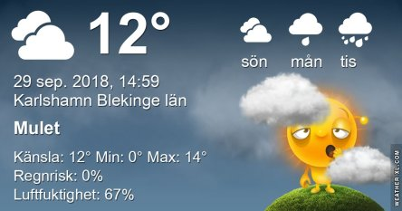
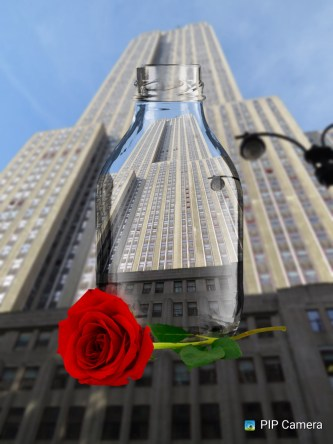

Idag går solen upp 06:59 och ned 18:41. Dagens längd är 11 timmar och 42 minuter. Det är gryning 06:22 och skymning 19:19 Det är dagsljus 12 timmar och 57 minuter. Månen går upp 20:57 och ned 11:44 Månen är belyst 84 %.

 Mest klart - 2,2 C  Vindstilla  Luftfuktighet 93 %  hPa 1020 Kl.02:15

 Växlande molnighet - 3,4 C  Vindby 0,7 m/s SE  Luftfuktighet 99 %  hPa 1021 Kl.06:45

 Mest molnigt 17,2 C  Vindby 5,1 m/s ESE  Luftfuktighet 52 %  hPa 1019 Kl.14:25

 Mest molnigt 9,3 C  Vindby 1,8 m/s ENE  Luftfuktighet 69 %  hPa 1016 Kl.19:55

 Inatt fick vi vår andra frysnatt för säsongen. Alldeles för tidigt för min smak. Det har ju inte ens blivit höst på riktigt än!

Högst och lägst uppmätta temperatur igår (inofficiellt privat mätare): Max 22,6 C ( i solen ) , Min - 1 C Högst uppmätta vind 3,4 m/s, Högst uppmätta vindby 5,8 m/s

Högst och lägst uppmätta temperatur igår (officiellt enligt [YR.NO](http://www.vackertvader.se/v%C3%A4derstation/karlshamn?utm_source=email&utm_medium=email&utm_campaign=asarum)) Max 14,7 C, Min - 1,3 C Högst uppmätta vind 4,8 m/s. Högst uppmätta vindby 14 m/s

 

 I brist på annat så lekte jag med några bilder i Pip Camera Överst är jordgloben utanför Trump Tower i NY. Under den är Trump Tower. Sen kommer två bilder på Empire State Building. En tagen från marken och en tagen från Top of the Rock. Efter den kommer en bild på Rockefeller Center eller Top of the Rock som den kallas. Sist en bild på hotellet där de spelade in Ensam hemma 2 Vilse i New York. Ett hotell som ligger lååååångt över vår prisklass. Det kostar ungefär 10 800 kronor per natt att få ett rum där. Men oj vad lyxigt det är. Det kan ni se [här](https://www.tripadvisor.se/Hotel_Review-g60763-d675616-Reviews-The_Plaza-New_York_City_New_York.html#photos;aggregationId=101&albumid=101&filter=7&ff=134349686). Det är sånt som man får nöja sig med att drömma och fantisera om.
