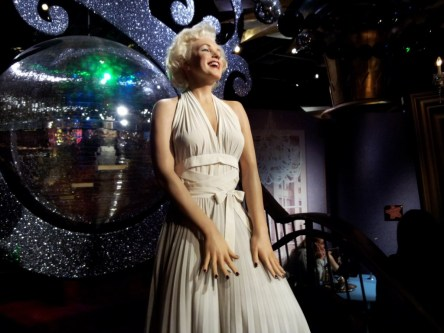
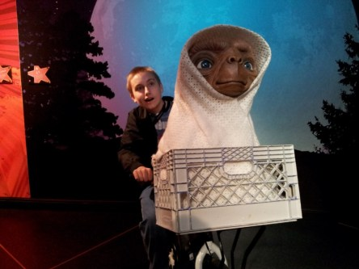
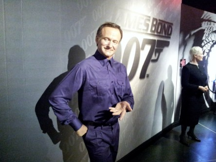

Idag går solen upp 07:07 och ned 18:31. Dagens längd är 11 timmar och 24 minuter. Det är gryning 06:30 och skymning 19:08 Det är dagsljus 12 timmar och 38 minuter. Månen går upp 23:03 och ned 16:15 Månen är belyst 42 %.

 Växlande molnighet 5,6 C  Vindby 1 m/s W  Luftfuktighet 97 %  hPa 990  Regn 1,2 mm Kl.02:050

 Molnigt 6 C  Vindby 2,6 m/s N  Luftfuktighet 89 %  hPa 996 Kl.07:00

 Växlande molnighet 14,3 C  Vindby 3,1 m/s SW   Luftfuktighet 56 %  hPa 1005 Kl.13.15

 Mest klart 2,3 C  Vindstilla  Luftfuktighet 87 %  hPa 1011 Kl.19:45

 Jag vill inte ha vinter än. Det är för tidigt med frysgrader varje natt.

Högst och lägst uppmätta temperatur igår (inofficiellt privat mätare): Max 11,1 C , Min - 2,5 C Högst uppmätta vind 4,4 m/s, Högst uppmätta vindby 6,8 m/s

Högst och lägst uppmätta temperatur igår (officiellt enligt [YR.NO](http://www.vackertvader.se/v%C3%A4derstation/karlshamn?utm_source=email&utm_medium=email&utm_campaign=asarum)) Max 9,5 C, Min – 2 C Högst uppmätta vind 3,3 m/s. Högst uppmätta vindby 9,7 m/s

 Här är ett litet axplock bland kändisar på Madame Tussauds i London från vårt besök där 2013. Här är det Orlando Bloom

 Morgan Freeman

 Helen Mirren

 Johnny Depp

 Jim Carrey

 Charlie Chaplin

 Marilyn Monroe

 Johannes och ET

 Robin Williams

 Johannes och Steven Spielberg

 Skräckmästaren Alfred Hitchcock

 Muhammed Ali

 Pele

 Prinsessan Diana

 Einstein

 The Beatles

 Michael Jackson

 Och sist men inte minst: Jag och snyggingen George Clooney
