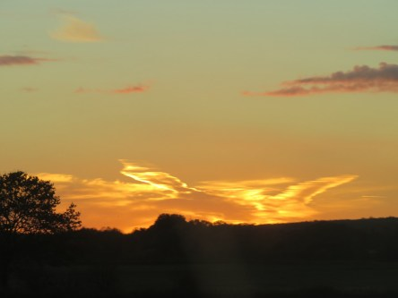

Idag går solen upp 07:12 och ned 16:15 Dagens längd är 9 timmar och 03 minuter. Det är gryning 06:32 och skymning 16:56 Det är dagsljus 10 timmar och 24 minuter. Månen går upp 01:13 och ned 15:18 Månen är belyst 24 %.

 Mest klart 6,5 C  Vindby 2,6 m/s SSW  Luftfuktighet 79 %  hPa 1019 Kl.01:25

 Växlande molnighet 5,8 C  Vindby 0,7 m/s SE  Luftfuktighet 90 %  hPa 1022 Kl.07:00

 Växlande molnighet 11,7 C  Vindby 1,8 m/s NNW  Luftfuktighet 54 %  hPa 1023 Kl.13:25

 Mest klart 0,9 C  Vindby 0,3 m/s W  Luftfuktighet 85 %  hPa 1024 Kl.20:00

 Vita moln, sol och varmt idag.

Högst och lägst uppmätta temperatur igår (inofficiellt privat mätare): Max 14,9 C , Min 2,4 C Högst uppmätta vind 3,1 m/s, Högst uppmätta vindby 4,4 m/s

Högst och lägst uppmätta temperatur igår (officiellt enligt [YR.NO](http://www.vackertvader.se/v%C3%A4derstation/karlshamn?utm_source=email&utm_medium=email&utm_campaign=asarum)) Max 10 C, Min 1,3 C Högst uppmätta vind 3,2 m/s. Högst uppmätta vindby 6,9 m/s

 Fantastisk solnedgång på vägen ner till Helsingborg idag.

 Kvällen höjdpunkt: Björn Skifs med bitar ur mitt liv.
