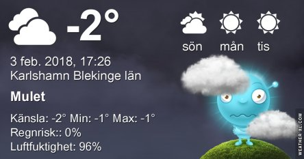

Idag går solen upp 07:53 och ned 16:36. Månen går upp 20:44 och ned 09:18 Månen är belyst 92 %. Dagens längd är 8 timmar och 43 minuter

 Molnigt - 4,1 C  Vindstilla  Luftfuktighet 87 %  hPa 997 Kl.01:10

 Molnigt - 4,6 C  Vindstilla  Luftfuktighet 85 %  hPa 997 Kl.07:00

 Molnigt 0 C  Vindstilla  Luftfuktighet 81 %  hPa 999 Kl.13:30

 Molnigt - 2,1 C  Vindstilla  Luftfuktighet 91 %  hPa 1003 Kl.19:50

 Kallt och glashalt. Typiskt innesittarväder.

Högst och lägst uppmätta temperatur igår (inofficiellt privat mätare): Max 3,3 C , Min - 3,3 C Högst uppmätta vind 1,4 m/s. Högst uppmätta vindby 2 m/s.

Högst och lägst uppmätta temperatur igår (officiellt enligt [YR.NO](http://www.vackertvader.se/v%C3%A4derstation/karlshamn?utm_source=email&utm_medium=email&utm_campaign=asarum)) Max 2 C, Min - 4 C Högst uppmätta vind 2,7 m/s. Högst uppmätta vindby 5 m/s

 Vinter, blixthalka och fortsatt kallt 😔
