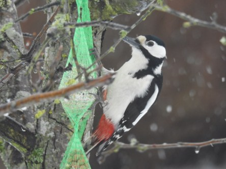
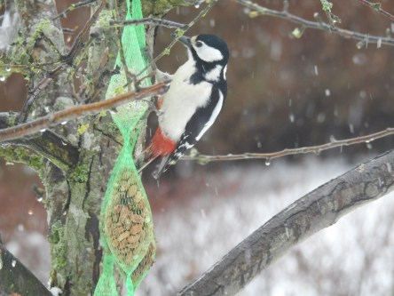
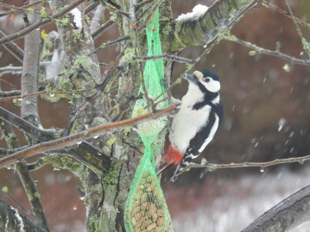
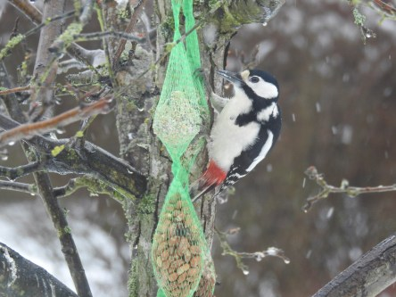
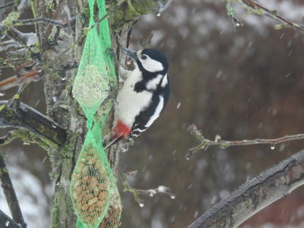

Idag går solen upp 06:26 och ned 19:42. Månen går upp 23:17 och ned 08:03 Månen är belyst 93 %. Dagens längd är 13 timmar och 16 minuter

 Halvklart - 6,9 C  Vindstilla  Luftfuktighet 72 %  hPa 1002 Kl.02:10

 Molnigt - 2 C  Vindstilla  Luftfuktighet 65 %  hPa 1000 KL.07:10

 Blötsnö 4,2 C  Vindby 2,2 m/s WSW  Luftfuktighet 87 %  hPa 999  Snödjup ca 4 cm Kl.13:00

 Dimma  0,4 C  Vindby 2,4 m/s E  Luftfuktighet 94 %  hPa 1000  Regn/snö 5,5 mm Kl.20:00

 Helt otroligt, idag är det full vinter igen.

Högst och lägst uppmätta temperatur igår (inofficiellt privat mätare): Max 15 C , Min – 4 C Högst uppmätta vind 3,7 m/s. Högst uppmätta vindby 6,1 m/s.

Högst och lägst uppmätta temperatur igår (officiellt enligt [YR.NO](http://www.vackertvader.se/v%C3%A4derstation/karlshamn?utm_source=email&utm_medium=email&utm_campaign=asarum)) Max 8,7 C, Min – 4,8 C Högst uppmätta vind 3,9 m/s. Högst uppmätta vindby 10;6 m/s

 Det blev en kort vår. Idag var det full vinter igen. Ett ljus i mörkret var att Hacke kom på besök igen.
