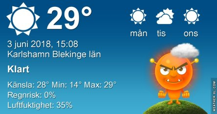

Idag går solen upp 04:19 och ned 21:38. Månen går upp 00:32 och ned 08:36 Månen är belyst 82 %. Dagens längd är 17 timmar och 19 minuter

 Mest klart 11,2 C  Vindby 0,3 m/s NW  Luftfuktighet 97 %  hPa 1010 Kl.01:50

 Klart 24,3 C  Vindby 1,4 m/s SW  Luftfuktighet 54 %  hPa 1010 Kl.07:35

 Klart 33,4 C  Vindby 2,8 m/s NNW  Luftfuktighet 30 %  hPa 1009 Kl.13:50

 Mest klart 24,7 C  Vindby 1,6 m/s SSW  Luftfuktighet 43 %  hPa 1009 Kl.20:15

 Varmaste dagen hittills. Över 40 grader i solen och över 30 grader i skuggan. Hur länge till ska man orka. Illamående och huvudvärk kommer som ett brev på posten. Enda fördelen är att man slipper mördarsniglarna. Och att klippa gräset.

Högst och lägst uppmätta temperatur igår (inofficiellt privat mätare): Max 35,2 C ( i solen ), Min 8,1 C Högst uppmätta vind 2 m/s. Högst uppmätta vindby 4,1 m/s

Högst och lägst uppmätta temperatur igår (officiellt enligt [YR.NO](http://www.vackertvader.se/v%C3%A4derstation/karlshamn?utm_source=email&utm_medium=email&utm_campaign=asarum)) Max 24,7 C, Min 7,6 C Högst uppmätta vind 3,3 m/s. Högst uppmätta vindby 7,1 m/s

