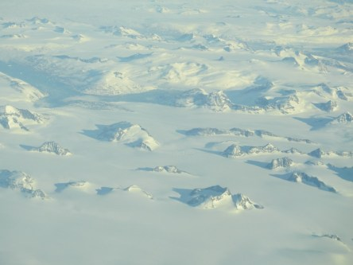
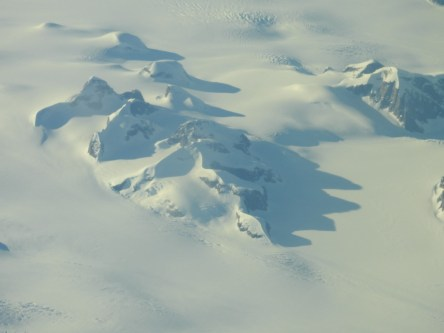
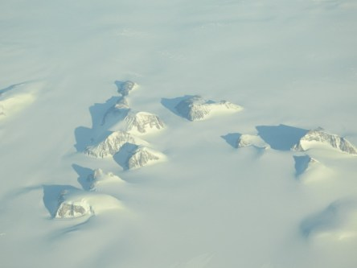
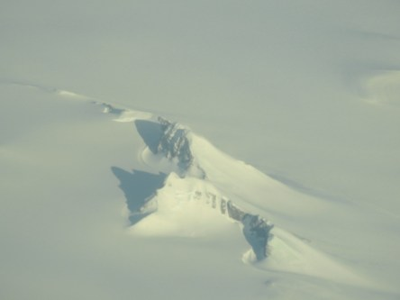
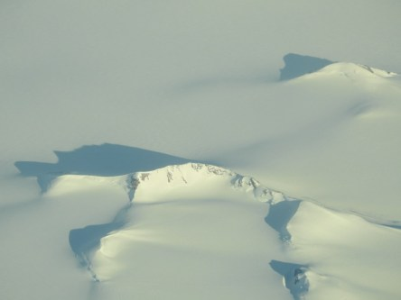
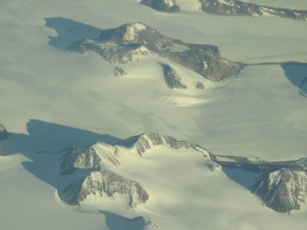
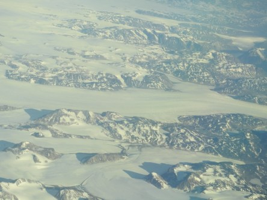
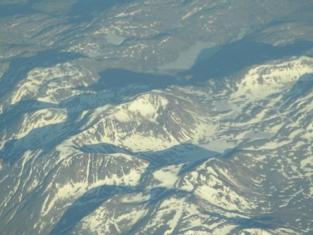

Idag går solen upp 04:19 och ned 21:50. Dagens längd är 17 timmar och 31 minuter. Det är gryning 03:17 och skymning 22:51 Det är dagsljus 19 timmar och 34 minuter. Månen går upp 00:04 och ned 09:39 Månen är belyst 80 %.

 Växlande molnighet 9,2 C  Vindstilla  Luftfuktighet 87 %  hPa 1011 Kl.01:20

 Mest molnigt 15,1 C  Vindby 1,4 m/s SW  Luftfuktighet 76 %  hPa 1010 Kl.07:30

 Mest klart 29,6 C  Vindby 3,4 m/s SE  Luftfuktighet 46 %  hPa 1009 Kl.13:35

 Växlande molnighet 21,4 C  Vindby 2 m/s SE  Luftfuktighet 50 %  hPa 1008 Kl.21:05

 Det lönar sig väl knappast att bli arg, men tre månader utan regn gör en inte glad precis.

Högst och lägst uppmätta temperatur igår (inofficiellt privat mätare): Max 31,1 C ( i solen ), Min 5,6 C Högst uppmätta vind 3,1 m/s. Högst uppmätta vindby 5,4 m/s

Högst och lägst uppmätta temperatur igår (officiellt enligt [YR.NO](http://www.vackertvader.se/v%C3%A4derstation/karlshamn?utm_source=email&utm_medium=email&utm_campaign=asarum)) Max 24,7 C, Min 5,5 C Högst uppmätta vind 4,1 m/s. Högst uppmätta vindby 10,3 m/s

 Här är några bilder på Grönland som jag tog när vi flög över där. Skulle vara kul att veta hur djup snön verkligen är och hur höga bergen är. Allt ser ju så litet ut från 10 000 meters höjd.
