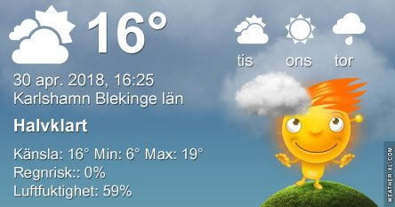
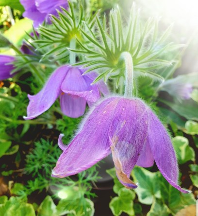

Idag går solen upp 05:19 och ned 20:37. Månen går upp 20:59 och ned 06:05 Månen är belyst 100 %. Dagens längd är 15 timmar och 18 minuter

 Växlande molnighet 5,5 C  Vindby 1,4 m/s N  Luftfuktighet 93 %  hPa 1007 Kl.01:30

 Växlande molnighet 12,2 C  Vindby 1,4 m/s S  Luftfuktighet 76 %  hPa 1003 Kl.07:30

 Mest molnigt 19,1 C  Vindby 6 m/s NE  Luftfuktighet 62 %  hPa 998 Kl.13:50

 Molnigt och regn och åskskurar tidigare 9 C  Vindby 4,2 m/s NE  Luftfuktighet 97 %   hPa 996  Regn 2,8 mm Kl.20:00

 Väldigt blåsigt idag och senare ska det bli regn.

Högst och lägst uppmätta temperatur igår (inofficiellt privat mätare): Max 22 C ( 28,4 C i solen ), Min 4,3 C Högst uppmätta vind 3,1 m/s. Högst uppmätta vindby 4,8 m/s.

Högst och lägst uppmätta temperatur igår (officiellt enligt [YR.NO](http://www.vackertvader.se/v%C3%A4derstation/karlshamn?utm_source=email&utm_medium=email&utm_campaign=asarum)) Max 17,6 C, Min 4,6 C Högst uppmätta vind 3,4 m/s. Högst uppmätta vindby 8,3 m/s

 Nu blommar det för fullt i trädgården. Så härligt. Man njuter för fullt.
