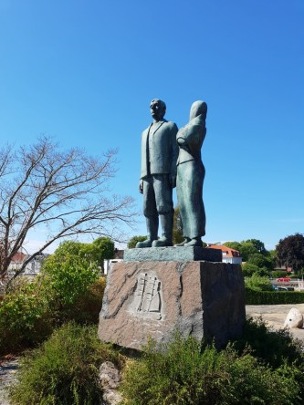
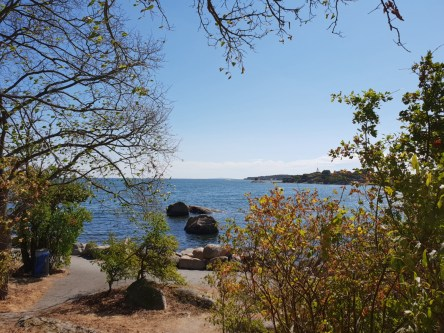
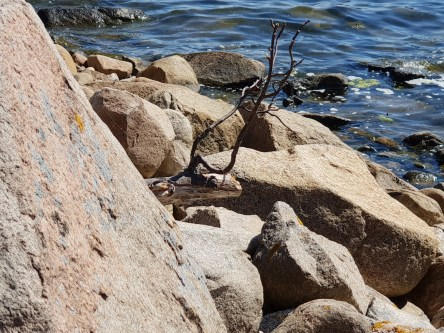
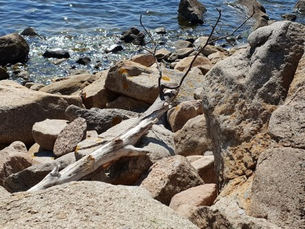
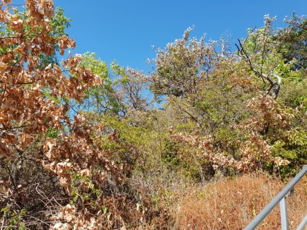
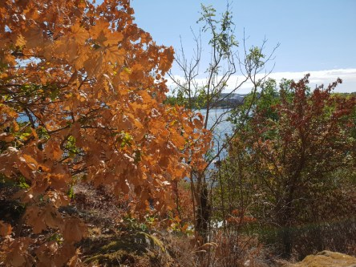
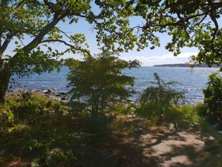
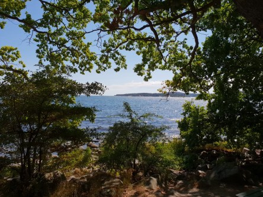
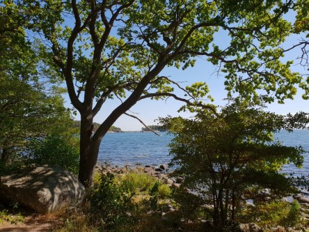
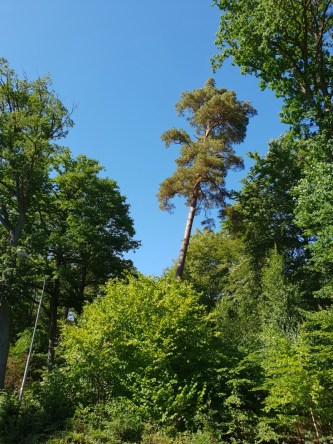

Idag går solen upp 04:59 och ned 21:13. Dagens längd är 16 timmar och 14 minuter. Det är gryning 04:10 och skymning 22:03 Det är dagsljus 17 timmar och 53 minuter. Månen går upp 22:30 och ned 07:28 Månen är belyst 95 %.

 Klar 17,4 C  Vindby 0,3 m/s W  Luftfuktighet 71 %  hPa 1012 Kl.02:10

 Mest klart 15,4 C  Vindstilla  Luftfuktighet 78 %  hPa 1013 Kl.06:20

 Klart 35,2 C  Vindby 3,8 m/s NNW  Luftfuktighet 30 %  hPa 1014 Kl.13:30

 Halvklart 25,3 C  Vindby 1,4 m/s SW  Luftfuktighet 46 %  hPa 1014 Kl.20:05

 Fortsatt tröttsamt varmt!

Högst och lägst uppmätta temperatur igår (inofficiellt privat mätare): Max 34,8 C ( i solen ), Min 18,1 C Högst uppmätta vind 2 m/s. Högst uppmätta vindby 3,4 m/s

Högst och lägst uppmätta temperatur igår (officiellt enligt [YR.NO](http://www.vackertvader.se/v%C3%A4derstation/karlshamn?utm_source=email&utm_medium=email&utm_campaign=asarum)) Max 28,9 C, Min 17,8 C Högst uppmätta vind 4,6 m/s. Högst uppmätta vindby 8,4 m/s

 Jag tog mig samman och gick en runda vid strandpromenaden i Karlshamn idag. Jag började med att hälsa på Karl Oscar och Kristina från Utvandrarna.

 Det fläktade skönt nere vid havet. Men torkan har satt sina spår här. Det är inte alls lika grönt och fint som det brukar vara här.

 Efter en liten bit tittar en mystisk figur fram bakom stenarna. kan det vara...

 ... ett sjöodjur! Ja minsann det var det. Men han verkade rätt trött och beskedlig.

 Den sorgliga konsekvensen av torkan syns tydligt när man kommer längre upp i backen. Det ser ut som höst.

 Men det finns fortfarande kvar några ställen där det är grönt.

 Men den här tallen verkar mest vilja lägga sig ner.
