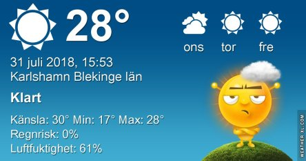
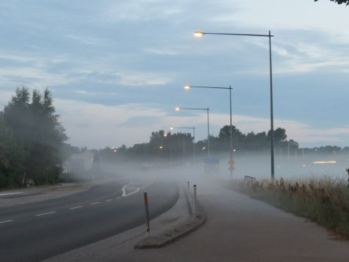
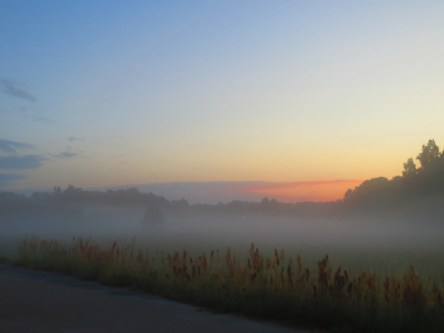
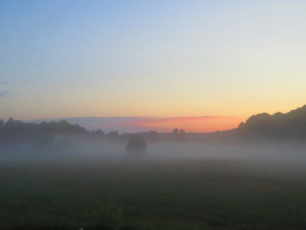

Idag går solen upp 05:01 och ned 21:11. Dagens längd är 16 timmar och 10 minuter. Det är gryning 04:12 och skymning 22:00 Det är dagsljus 17 timmar och 48 minuter. Månen går upp 22:48 och ned 08:38 Månen är belyst 91 %.

 Mest klart 15,1 C  Vindstilla  Luftfuktighet 90 %  hPa 1015 Kl.02:25

 Klart 20,7 C  Vindstilla  Luftfuktighet 72 %  hPa 1015 Kl.07:00

 Mest klart 33,9 C  Vindby 3,6 m/s NW  Luftfuktighet 54 %  hPa 1015 Kl.14:00

 Halvklart 21,4 C  Vindby 0,8 m/s ESE  Luftfuktighet 89 %  hPa 1014 Kl.21:10

 Humöret sjunker för varje grad som  temperaturen stiger.

Högst och lägst uppmätta temperatur igår (inofficiellt privat mätare): Max 36,2 C ( i solen ), Min 14 C Högst uppmätta vind 4,1 m/s. Högst uppmätta vindby 5,4 m/s

Högst och lägst uppmätta temperatur igår (officiellt enligt [YR.NO](http://www.vackertvader.se/v%C3%A4derstation/karlshamn?utm_source=email&utm_medium=email&utm_campaign=asarum)) Max 30,1 C, Min 14 C Högst uppmätta vind 3,5 m/s. Högst uppmätta vindby 7,1 m/s

 Dagen började svalt och skönt med dimma och 14 grader...

 och sen gick det så här 😭😭😭
