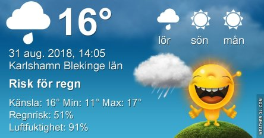
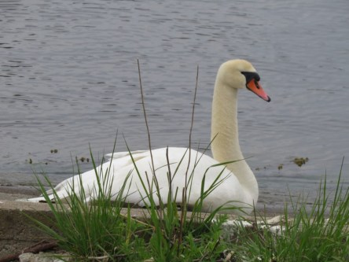

Idag går solen upp 06:02 och ned 19:58. Dagens längd är 13 timmar och 56 minuter. Det är gryning 05:22 och skymning 20:38 Det är dagsljus 15 timmar och 16 minuter. Månen går upp 22:55 och ned 11:21 Månen är belyst 80 %.

 Regn 14,2 C  Vindby 1 m/s W  Luftfuktighet 98 %  hPa 1009  Regn 4,5 mm Kl.02:20

 Molnigt 14,4 C  Vindby 2,2 m/s W  Luftfuktighet 95 %  hPa 1009  Regn 8,5 mm Kl.08:05

 Molnigt 18,6 C  Vindby 3 m/s NE  Luftfuktighet 79 %  hPa 1011 Kl.13:45

 Molnigt 13,9 C  Vindby 1,6 m/s SSW  Luftfuktighet 90 %  hPa 1012 Kl.19:50

 Äntligen har det kommit lite regn. Och mer ska det bli om allt stämmer.

Högst och lägst uppmätta temperatur igår (inofficiellt privat mätare): Max 23,3 C , Min 11,7 C Högst uppmätta vind 2 m/s. Högst uppmätta vindby 3,4 m/s

Högst och lägst uppmätta temperatur igår (officiellt enligt [YR.NO](http://www.vackertvader.se/v%C3%A4derstation/karlshamn?utm_source=email&utm_medium=email&utm_campaign=asarum)) Max 20 C, Min 10,6 C Högst uppmätta vind 3,8 m/s. Högst uppmätta vindby 6,4 m/s

 Svanfamilj vid strandpromenaden i Karlshamn. Ur arkivet igen.
