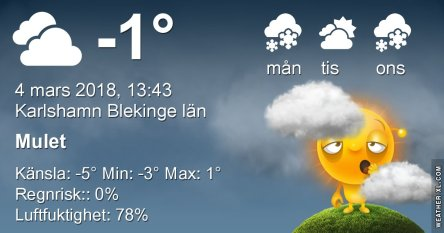
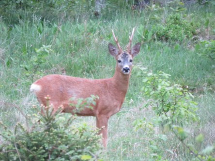
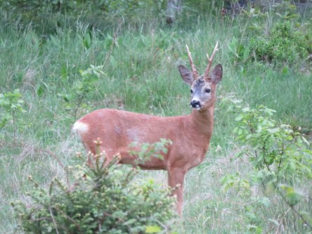
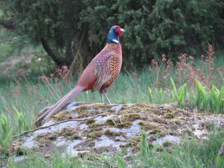

Idag går solen upp 06:46 och ned 17:40. Månen går upp 20:55 och ned 08:00 Månen är belyst 95 %. Dagens längd är 10 timmar och 54 minuter

 Molnigt - 4,7 C  Vindby 0,3 m/s E  Luftfuktighet 80 %  hPa 1005 Kl.01:20

 Molnigt - 3,2 C  Vindby 0,3 m/s SE  Luftfuktighet 81 %  hPa 1004 Kl.07:15

 Molnigt 2,3 C  Vindby 0,5 m/s SSW  Luftfuktighet 64 %  hPa 1004 Kl.13:45

 Växlande molnighet - 3,6 C  Vindby 1,7 m/s E  Luftfuktighet 70 %  hPa 1003 Kl.19:50

 Tröttvädret fortsätter idag också. Men i början på veckan kommer mildare väder in. Äntligen.

Högst och lägst uppmätta temperatur igår (inofficiellt privat mätare): Max 3,6 C, Min – 5,3 C Högst uppmätta vind 1,4 m/s. Högst uppmätta vindby 2,7 m/s.

Högst och lägst uppmätta temperatur igår (officiellt enligt [YR.NO](http://www.vackertvader.se/v%C3%A4derstation/karlshamn?utm_source=email&utm_medium=email&utm_campaign=asarum)) Max – 0,9 C, Min – 4,4 C Högst uppmätta vind 3 m/s. Högst uppmätta vindby 5,7 m/s

 Idag får det bli en återblick på förra våren i form av dessa bilder på ett rådjur, en björktrast och två fasaner.
