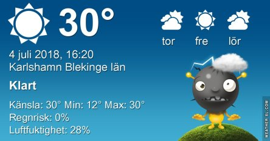
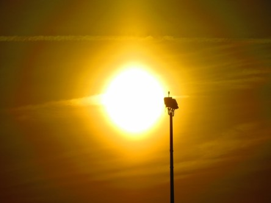
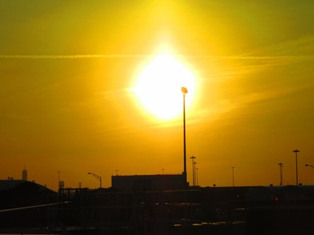
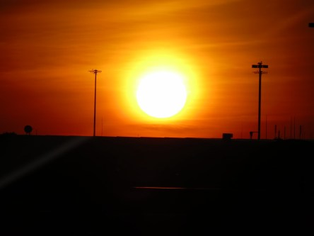

Idag går solen upp 04:20 och ned 21:49. Dagens längd är 17 timmar och 29 minuter. Det är gryning 03:19 och skymning 22:50 Det är dagsljus 19 timmar och 31 minuter. Månen går upp 00:24 och ned 15:50 Månen är belyst 72 %.

 Klart 10,8 C  Vindstilla  Luftfuktighet 79 %  hPa 1009 Kl.01:30

 Mest klart 24,9 C  Vindby 0,7 m/s NE  Luftfuktighet 42 %  hPa 1008 Kl.07:25

 Mest klart5 37,4 C (i solen) Vindby 3 m/s WNW  Luftfuktighet 18 %  hPa 1007 Kl.13:40

 Mest klart 27,2 C  Vindby 2,8 m/s W  Luftfuktighet 35 %  hPa 1005 Kl.19:45

 Idag har det varit som en bakugn ute. Nästan 40 grader i solen.

Högst och lägst uppmätta temperatur igår (inofficiellt privat mätare): Max 31,4 C ( i solen ), Min 9 C Högst uppmätta vind 2,7 m/s. Högst uppmätta vindby 4,1 m/s

Högst och lägst uppmätta temperatur igår (officiellt enligt [YR.NO](http://www.vackertvader.se/v%C3%A4derstation/karlshamn?utm_source=email&utm_medium=email&utm_campaign=asarum)) Max 27,9 C, Min 10,2 C Högst uppmätta vind 4,3 m/s. Högst uppmätta vindby 9,9 m/s

 Helt underbar solnedgång över JFK flygplatsen.
