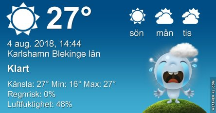
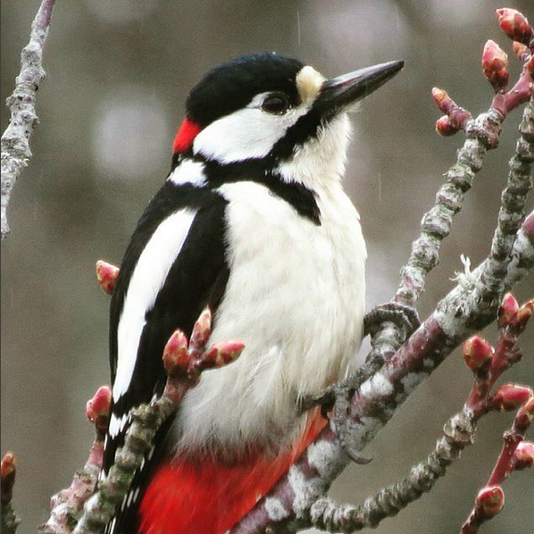

Idag går solen upp 05:09 och ned 21:03. Dagens längd är 15 timmar och 54 minuter. Det är gryning 04:21 och skymning 21:51 Det är dagsljus 17 timmar och 30 minuter. Månen går upp 23:33 och ned 13:32 Månen är belyst 57 %.

 Mest klart 13,5 C  Vindstilla  Luftfuktighet 73 %  hPa 1014 Kl.02:20

 Mest molnigt 15,6 C  Vindstilla  Luftfuktighet 73 %  hPa 1013 Kl.06:15

 Växlande molnighet 33,5 C  Vindby 4,8 m/s SE  Luftfuktighet 33 %  hPa 1010 Kl.14:20

 Halvklart 18,6 C  Vindby 1,4 m/s SE  Luftfuktighet 67 %  hPa 1010 Kl.22:30

 Dagen började så bra med mörka moln och svalt. Sen spårade det ur igen.

Högst och lägst uppmätta temperatur igår (inofficiellt privat mätare): Max 33,2 C ( i solen ), Min 11,3 C Högst uppmätta vind 3,4 m/s. Högst uppmätta vindby 5 m/s

Högst och lägst uppmätta temperatur igår (officiellt enligt [YR.NO](http://www.vackertvader.se/v%C3%A4derstation/karlshamn?utm_source=email&utm_medium=email&utm_campaign=asarum)) Max 29,2 C, Min 12,3 C Högst uppmätta vind 3,7 m/s. Högst uppmätta vindby 8,1 m/s

 I brist på ork att ta bilder får det bli den här skylten idag.
