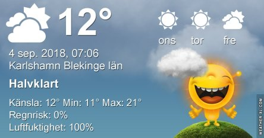
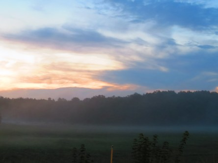
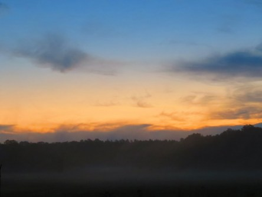

Idag går solen upp 06:10 och ned 19:48. Dagens längd är 13 timmar och 38 minuter. Det är gryning 05:31 och skymning 20:27 Det är dagsljus 14 timmar och 56 minuter. Månen går upp 23:25 och ned 16:27 Månen är belyst 39 %.

 Växlande molnighet 8,7 C  Vindstilla  Luftfuktighet 98 %  hPa 1017 Kl.02:15

 Dimma och molnigt 10,9 C  Vindby 0,4 m/s E  Luftfuktighet 97 %  hPa 1016 Kl.06:50

 Växlande molnighet 25,3 C  Vindby 1,4 m/s W  Luftfuktighet 52 %  hPa 1015 Kl.13:25

 Halvklart 13,3 C  Vindstilla  Luftfuktighet 91   hPa 1016 Kl.21:00

 Det började bra med dimma och moln, men sen blev det riktigt varmt igen.

Högst och lägst uppmätta temperatur igår (inofficiellt privat mätare): Max 28,8 C ( i solen ), Min 9,4 C Högst uppmätta vind 2 m/s. Högst uppmätta vindby 3,7 m/s

Högst och lägst uppmätta temperatur igår (officiellt enligt [YR.NO](http://www.vackertvader.se/v%C3%A4derstation/karlshamn?utm_source=email&utm_medium=email&utm_campaign=asarum)) Max 21,3 C, Min 7,3 C Högst uppmätta vind 4 m/s. Högst uppmätta vindby 7,3 m/s

 Nu märks det verkligen att vi går mot mörkare tider. Det blir ljust senare för varje dag som går. Idag låg dimman tätt och mörka moln tornade upp sig. Det var helt grått på morgonen, men sen vann solen som vanligt och regnet uteblev och värmen tog över.
