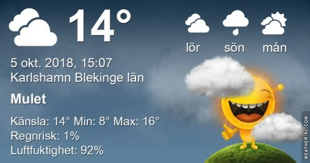
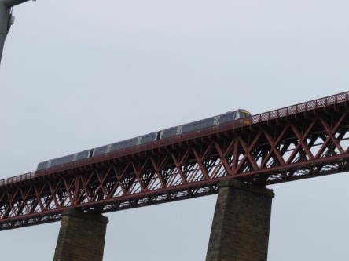
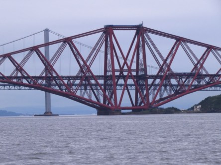
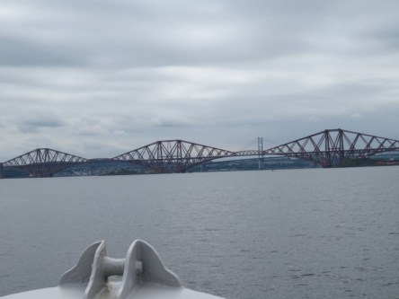
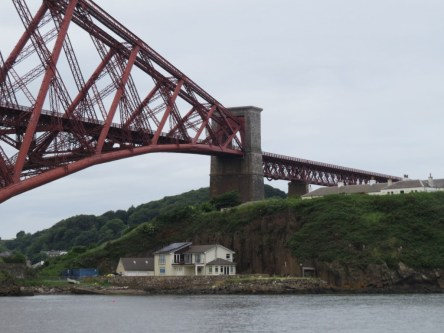
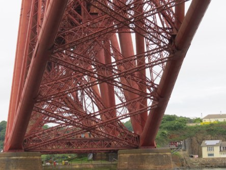
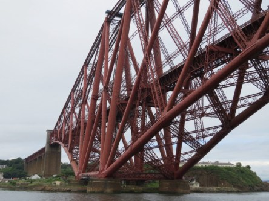

Idag går solen upp 07:11 och ned 18:26. Dagens längd är 11 timmar och 15 minuter. Det är gryning 06:34 och skymning 19:03 Det är dagsljus 12 timmar och 29 minuter. Månen går upp 01:45 och ned 17:24 Månen är belyst 21 %.

 Mest molnigt 10,4 C  Vindby 1 m/s NE  Luftfuktighet 95 %  hPa 1013 Kl.02:05

 Molnigt 11,5 C  Vindby 2,4 m/s SSE  Luftfuktighet 92 %  hPa 1012 Kl.07:00

 Molnigt 17,2 C  Vindby 2,4 m/s SW  Luftfuktighet 83 %  hPa 1012 Kl.14:15

 Molnigt 12 C  Vindby 1,4 m/s SE  Luftfuktighet 89 %  hPa 1012 Kl.20:00

 Hurra! Det ska bli brittsommar nästa vecka med behagliga temperaturer. Då kan man äntligen njuta av vädret och värmen utan att svettas ihjäl.

Högst och lägst uppmätta temperatur igår (inofficiellt privat mätare): Max 16,2 C , Min – 2,8 C Högst uppmätta vind 3,7 m/s, Högst uppmätta vindby 4,4 m/s

Högst och lägst uppmätta temperatur igår (officiellt enligt [YR.NO](http://www.vackertvader.se/v%C3%A4derstation/karlshamn?utm_source=email&utm_medium=email&utm_campaign=asarum)) Max 13,1 C, Min – 1,1 C Högst uppmätta vind 2,3 m/s. Högst uppmätta vindby 6,1 m/s

 Som den brofantast jag är så satt jag och drömde mig tillbaka till vår första Skottlandsresa när vi tog en båttur på Firth of Forth och jag tog dessa bilder på den berömda järnvägsbron Forth Brige. Den har varit med i ett antal filmer och serier och jag har sett den i en av alla brittiska serier jag följer, men jag kan inte komma på vilken. Så om det är någon annan som gillar brittiska serier och kan minnas att ni sett den här bron så är jag tacksam om ni vill tipsa om vilken serie det är. Vill ni läsa mer om bron så kan ni göra det [här](https://en.wikipedia.org/wiki/Forth_Bridge) eller [här](https://sv.wikipedia.org/wiki/Forthbron_\(j%C3%A4rnv%C3%A4gsbro\)) om ni hellre väljer svenska.
