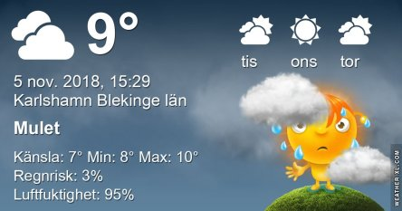
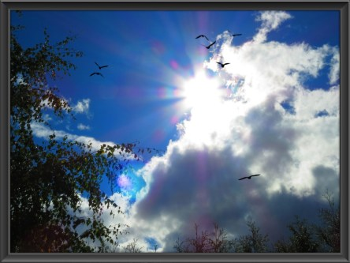

Idag går solen upp 07:16 och ned 16:11 Dagens längd är 8 timmar och 55 minuter. Det är gryning 06:36 och skymning 16:52 Det är dagsljus 10 timmar och 16 minuter. Månen går upp 03:55 och ned 15:55 Månen är belyst 8 %.

 Molnigt 7,8 C  Vindby 1 m/s E  Luftfuktighet 93 %  hPa 1016 Kl.02:15

 Lätt regn 8,2 C  Vindby 1,2 m/s NE  Luftfuktighet 94 %  hPa 1014  Regn 0,5 mm Kl.06:30

 Molnigt 10,6 C  Vindby 2,2 m/s E  Luftfuktighet 93 %  hPa 1013  Regn 1,2 mm Kl.14:15

 Molnigt 9,2 C  Vindby 1,7 m/s WNW  Luftfuktighet 92 %  hPa 1012 Kl.19:55

 Grått, molnigt och väldigt milt hela dagen.

Högst och lägst uppmätta temperatur igår (inofficiellt privat mätare): Max 12,5 C , Min – 3,3 C Högst uppmätta vind 2,4 m/s, Högst uppmätta vindby 3,4 m/s

Högst och lägst uppmätta temperatur igår (officiellt enligt [YR.NO](http://www.vackertvader.se/v%C3%A4derstation/karlshamn?utm_source=email&utm_medium=email&utm_campaign=asarum)) Max 9,5 C, Min – 1,1 C Högst uppmätta vind 3,9 m/s. Högst uppmätta vindby 7,5 m/s

 Solnedgång och moln från sommaren

 Och en barnslig tavla med en glad fisk!
