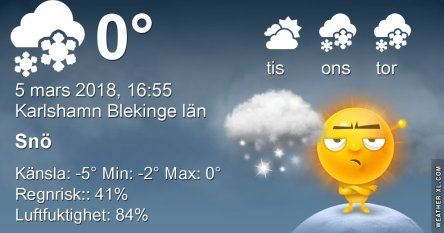
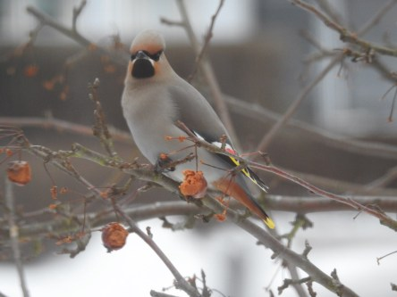
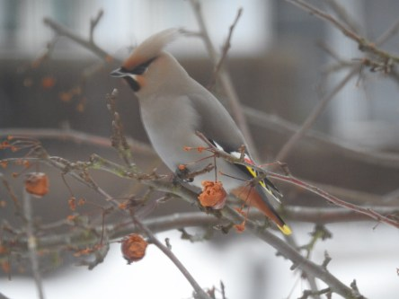
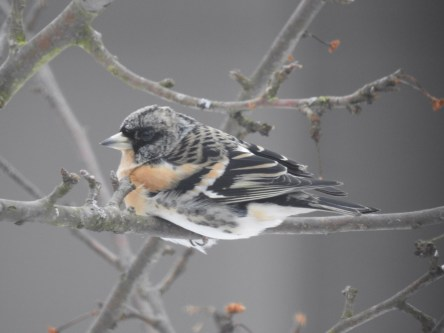
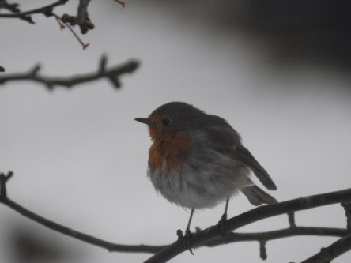

Idag går solen upp 06:43 och ned 17:42. Månen går upp 22:11 och ned 08:20 Månen är belyst 89 %. Dagens längd är 10 timmar och 59 minuter

 Molnigt - 2,4 C  Vindby 3,6 m/s SSW  Luftfuktighet 78 %   hPa 1001 Kl.02:15

 Molnigt - 2,1 C  Vindby 5 m/s SW  Luftfuktighet 74 %  hPa 998 Kl.07:10

 Molnigt 1,8 C  Vindby 3,4 m/s ESE  Luftfuktighet 70 %  hPa 996 Kl.14:05

 Molnigt - 1,4 C  Vindby 0,8 m/s N  Luftfuktighet 77 %  hPa 995 Kl.20:05

 Ännu en grå och trist dag. Men nu verkar det som om lite varmare väder är på gång.

Högst och lägst uppmätta temperatur igår (inofficiellt privat mätare): Max 3,1 C, Min – 5,7 C Högst uppmätta vind 1,7 m/s. Högst uppmätta vindby 3,1 m/s.

Högst och lägst uppmätta temperatur igår (officiellt enligt [YR.NO](http://www.vackertvader.se/v%C3%A4derstation/karlshamn?utm_source=email&utm_medium=email&utm_campaign=asarum)) Max – 0,4 C, Min – 4,6 C Högst uppmätta vind 3,5 m/s. Högst uppmätta vindby 5,7 m/s

 Sidensvansarna kom på besök idag igen.

 Bergfinkar tar en paus i ätandet.

 En liten rödhake burrar upp sig i kylan.
