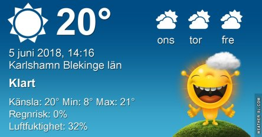
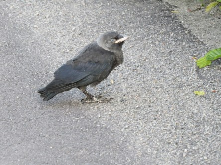
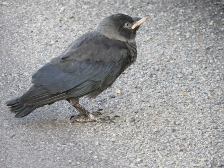
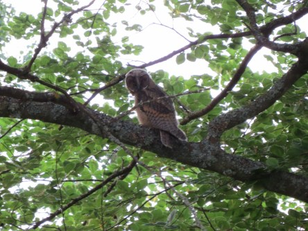
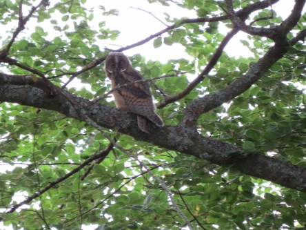
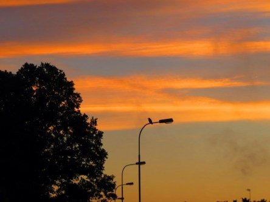

Idag går solen upp 04:17 och ned 21:40. Månen går upp 01:30 och ned 10:47 Månen är belyst 66 %. Dagens längd är 17 timmar och 23 minuter

 Mest klart 13,3 C  Vindby 0,6 m/s ENE  Luftfuktighet 98 %  hPa 1004 Kl.01:45

 Halvklart 16,1 C  Vindby 4,4 m/s W  Luftfuktighet 53 %  hPa 1007 Kl.07:05

 Halvklart 26,3 C  Vindby 3 m/s SSW  Luftfuktighet 46 %  hPa 1010 Kl.14:15

 Halvklart 10,6 C  Vindby 2 m/s ESE  Luftfuktighet 67 %  hPa 1013 Kl.21:25

 Idag har det varit betydligt svalare och blåsigt. Så skönt med en paus i värmen. Men redan imorgon kommer värmen tillbaka och stiger ytterligare i slutet på veckan.

Högst och lägst uppmätta temperatur igår (inofficiellt privat mätare): Max 32,8 C ( i solen ), Min 14,5 C Högst uppmätta vind 3,1 m/s. Högst uppmätta vindby 5,4 m/s

Högst och lägst uppmätta temperatur igår (officiellt enligt [YR.NO](http://www.vackertvader.se/v%C3%A4derstation/karlshamn?utm_source=email&utm_medium=email&utm_campaign=asarum)) Max 25,6 C, Min 14,2 C Högst uppmätta vind 4,6 m/s. Högst uppmätta vindby 10 m/s

 Den här lilla kajaungen har jag sett två morgnar i rad och första morgonen satt den bara på vägen och gick sakta iväg när jag kom. Den andra morgonen hade den övat på sin flygförmåga och flög små korta sträckor och det syntes hur roligt den hade. Precis som när ett litet barn lärt sig gå.

 Igårkväll lyckdes jag fånga den här ugglan på bild. Det var i motljus och ganska långt avstånd så bilderna blev inte särskilt skarpa. Men jag tycker ugglan är så fin att den är värd att visas upp ändå. Jag är dock inte säker på vad det är för uggla. Det ser inte ut som en kattuggla men lätet var väldigt lik deras. Är det någon som vet vad det kan vara för sort? Jag är ganska säker nu på att det är en hornuggleungeunge.

 Och så här vacker var himlen idag på morgonen.
