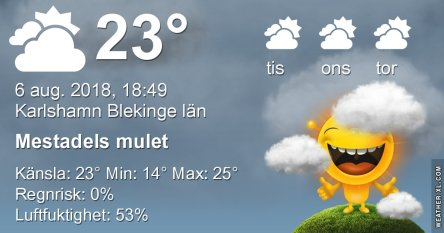
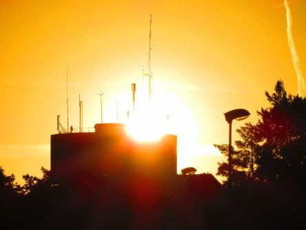

Idag går solen upp 05:13 och ned 20:49. Dagens längd är 15 timmar och 46 minuter. Det är gryning 04:26 och skymning 21:45 Det är dagsljus 17 timmar och 19 minuter. Månen går upp 00:26 och ned 16:07 Månen är belyst 38 %.

 Växlande molnighet 11,1 C  Vindby 0,3 m/s S  Luftfuktighet 85 %  hPa 1011 Kl.02:05

 Halvklart 9,9 C   Vindstilla  Luftfuktighet 94 %  hPa 1011 Kl.06:15

 Mest tunna moln 29,7 C  Vindby 5,2 m/s SW  Luftfuktighet 31 %  hPa 1011 Kl.13:40

 Molnigt 19,7 C  Vindby 1,8 m/s N  Luftfuktighet 56 %  hPa 1011 Kl.20:10

 En härligt sval dag med mest moln. Men säg den lycka som varar. Imorgon är supervärmen tillbaks igen, suck....

Högst och lägst uppmätta temperatur igår (inofficiellt privat mätare): Max 29,6 C ( i solen ), Min 13,3 C Högst uppmätta vind 5,4 m/s. Högst uppmätta vindby 8,8 m/s

Högst och lägst uppmätta temperatur igår (officiellt enligt [YR.NO](http://www.vackertvader.se/v%C3%A4derstation/karlshamn?utm_source=email&utm_medium=email&utm_campaign=asarum)) Max 23,9 C, Min 12,2 C Högst uppmätta vind 5,1 m/s. Högst uppmätta vindby 13.8 m/s

 Solen på väg upp idag igen. Men idag vann molnen kampen och det blev en härlig dag med normala temperaturer.
