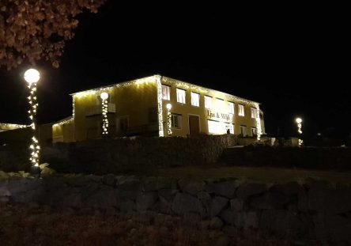

Idag går solen upp 08:18 och ned 15:26 Dagens längd är 7 timmar och 8 minuter. Det är gryning 07:31 och skymning 16:13 Det är dagsljus 8 timmar och 42 minuter. Månen går upp 08:02 och ned 15:54 Månen är belyst 0 %.

 Molnigt 6,3 C  Vindby 1 m/s NE  Luftfuktighet 93 %  hPa 999  Regn 0,5 mm Kl.02:25

 Molnigt 8,1 C  Vindby 2,2 m/s SW  Luftfukitghet 94 %  hPa 996 Kl.07:00

 Molnigt 9,6 C  Vindby 1,8 m/s WSW  Luftfuktighet 85 %  hPa 996  Regn 1,2 mm Kl.12:50

 Regn 7,1 C  Vindby 1,8 m/s E  Luftfuktighet 92 %  hPa 989  Regn 3,5 mm Kl.19:45

 Idag har det varit varmt och grått och riktigt tröttväder.

Högst och lägst uppmätta temperatur igår (inofficiellt privat mätare) Max 5,9 C , Min – 4,1 C Högst uppmätta vind 2,4 m/s, Högst uppmätta vindby 3,1 m/s

Högst och lägst uppmätta temperatur igår (officiellt enligt [YR.NO](http://www.vackertvader.se/v%C3%A4derstation/karlshamn?utm_source=email&utm_medium=email&utm_campaign=asarum)) Max 5,7 C, Min – 4,2 C Högst uppmätta vind 2,6 m/s. Högst uppmätta vindby 6,6 m/s

\[gallery type="rectangular" link="file" size="medium" ids="25810,25805,25809,25808,25807,25806,25802"\]

Mer av kloka ord får det bli idag. Jag hoppas att motivationen och energin ska infinna sig snart igen så att det blir lite nya bilder att visa snart.

 Det här är det närmaste en ljusfestival vi kommer i min kommun. Lamphuset 😂

 Och här en rolig historia från dagens tidning. Tänk vilken tur att man alltid kan lita på Posten!
