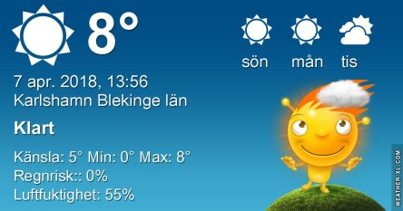
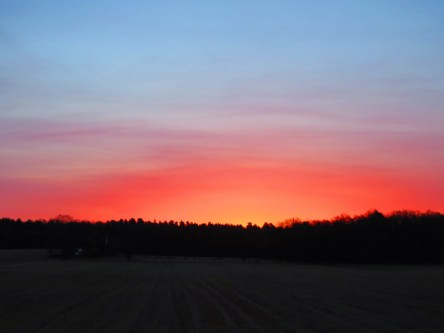
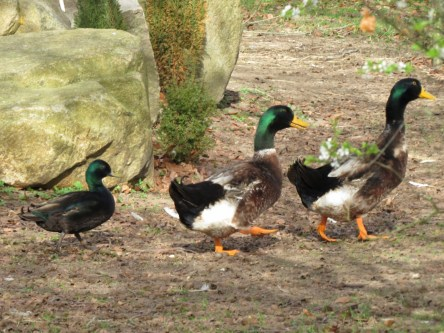
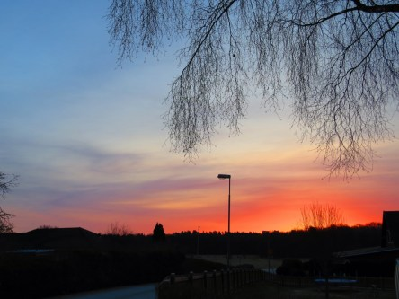

Idag går solen upp 06:16 och ned 19:50. Månen går upp 02:27 och ned 10:13 Månen är belyst 62 %. Dagens längd är 13 timmar och 34 minuter

 Klart - 3,9 C  Vindstilla  Luftfuktighet 77 %  hPa 1019 Kl.02:35

 Höga slöjmoln - 2,3 C  Vindstilla  Luftfuktighet 84 %  hPa 1019 Kl.07:25

 Mest tunna moln 13,7 C  Vindby 5,6 m/s E  Luftfuktighet 42 %  hPa 1018 Kl.13:10

 Mest molnigt 5,6 C  Vindby 2,4 m/s NNE  Luftfuktighet 45 %  hPa 1012 Kl.19:50

 Ännu en blåsig men solig dag. Så härligt att se solen igen.

Högst och lägst uppmätta temperatur igår (inofficiellt privat mätare): Max 15 C , Min 0,3 C Högst uppmätta vind 6,1 m/s. Högst uppmätta vindby 11,2 m/s.

Högst och lägst uppmätta temperatur igår (officiellt enligt [YR.NO](http://www.vackertvader.se/v%C3%A4derstation/karlshamn?utm_source=email&utm_medium=email&utm_campaign=asarum)) Max 9,8 C, Min - 2,1 C Högst uppmätta vind 5,7 m/s. Högst uppmätta vindby 15,3 m/s

 Äntligen kan jag ta nya bilder på soluppgångar igen. Den här är från idag. En väldigt skiftande och färgsprakande himmel bjöds det på.
