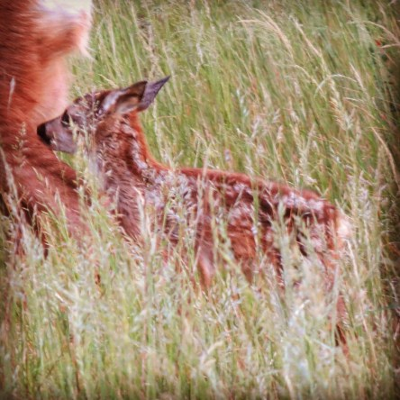

Idag går solen upp 04:16 och ned 21:43. Månen går upp 02:10 och ned 13:09 Månen är belyst 47 %. Dagens längd är 17 timmar och 27 minuter

 Mest klart 6,4 C  Vindstilla  Luftfuktighet 96 %  hPa 1016 Kl.01:40

 Mest klart 13,8 C  Vindstilla  Luftfuktighet 63 %  hPa 1016 Kl.06:50

 Tunna slöjmoln 26,2 C  Vindby 6,8 m/s NW  Luftfuktighet 40 %  hPa 1016 Kl.13:50

 Tunna slöjmoln 17,2 C  Vindby 1,4 m/s NW  Luftfuktighet 55 %  hPa 1013 Kl.20:15

 Idag har det varit varmt igen och blåsigt.

Högst och lägst uppmätta temperatur igår (inofficiellt privat mätare): Max 25,4 C ( i solen ), Min 3,6 C Högst uppmätta vind 3,1 m/s. Högst uppmätta vindby 8,2 m/s

Högst och lägst uppmätta temperatur igår (officiellt enligt [YR.NO](http://www.vackertvader.se/v%C3%A4derstation/karlshamn?utm_source=email&utm_medium=email&utm_campaign=asarum)) Max 18,1 C, Min 3,5 C Högst uppmätta vind 3,7 m/s. Högst uppmätta vindby 8,9 m/s

 En gråtrut går in för landning.

 Detta lilla charmtroll fick jag syn på efter att jag sett mamman gå och äta i det höga gräset. Den var så liten att den inte syntes först. Men helt plötsligt såg jag att något rörde sig jämte mamman och efter mycket väntade hamnade den i en "glänta" bland gräset och då lyckades jag få en bild på den.

 Här är mamma rådjur.

 Här ser man hur liten det lilla kidet är.

 Och som avslutning en återkommande vän.
