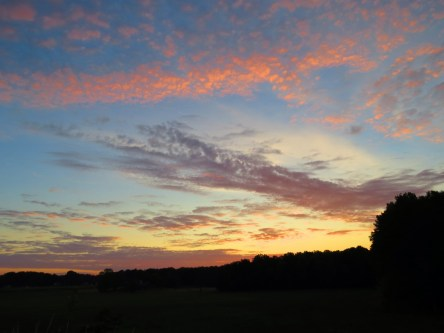
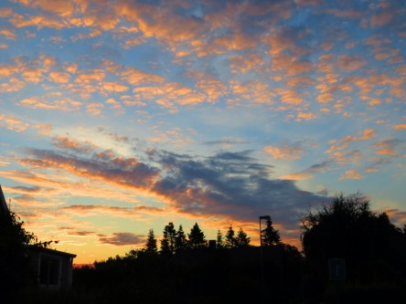
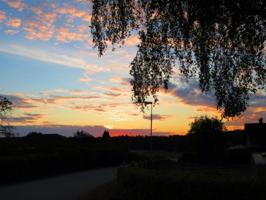
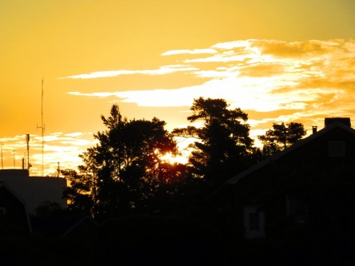

Idag går solen upp 05:15 och ned 20:57. Dagens längd är 15 timmar och 42 minuter. Det är gryning 04:28 och skymning 21:43 Det är dagsljus 17 timmar och 15 minuter. Månen går upp 00:59 och ned 17:22 Månen är belyst 38 %.

 Molnigt 15,4 C  Vindby 0,3 m/s N  Luftfuktighet 80 %  hPa 1011 Kl.02:00

 Växlande molnighet 14,4 C  Vindstilla  Luftfuktighet 91 %  hPa 1011 Kl.06:25

 Molnigt 28,1 C  Vindby 3,6 m/s NE  Luftfuktighet 60 %  hPa 1011 Kl.14:30

 Mest klart 19,4 C  Vindstilla  Luftfuktighet 79 %  hPa 1010 Kl.20:55

 Usch vad irriterande! Det kommer in svarta moln med jämna mellanrum men de har inte vett att släppa ifrån sig en droppe av sitt åtråvärda innehåll.

Högst och lägst uppmätta temperatur igår (inofficiellt privat mätare): Max 30,2 C ( i solen ), Min 9,8 C Högst uppmätta vind 5,1 m/s. Högst uppmätta vindby 7,8 m/s

Högst och lägst uppmätta temperatur igår (officiellt enligt [YR.NO](http://www.vackertvader.se/v%C3%A4derstation/karlshamn?utm_source=email&utm_medium=email&utm_campaign=asarum)) Max 25,6 C, Min 10,4 C Högst uppmätta vind 4,1 m/s. Högst uppmätta vindby 11,2 m/s

 Som vanligt den här sommaren så blev det en väldigt färgskiftande soluppgång idag igen.
