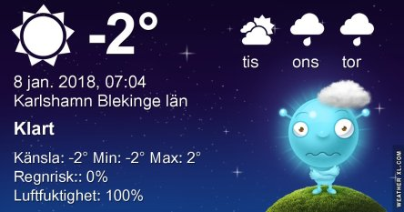

Idag går solen upp 08:30 och ned 15:45. Månen går upp 23:09 och ned 11:36 Månen är belyst 59 %. Dagens längd är 7 timmar och 15 minuter

 Klart - 6,3 C  Vindstilla  Luftfuktighet 89 %  hPa 1027 Kl.01:05

 Ökande molnighet - 3,6 C  Vindstilla  Luftfuktighet 92 %  hPa 1029 Kl.07:25

 Molnigt 0,9 C  Vindby 1,4 m/s NE  Luftfuktighet 96 %  hPa 1030 Kl.14:05

 Molnigt - 1,4 C  Vindstilla  Luftfuktighet 98 %  hPa 1032 Kl.19:50

 Efter en extremt kall natt är det återigen grått.

Högst och lägst uppmätta temperatur igår (inofficiellt privat mätare): Max 5,3 ( i solen ) C , Min – 9 C Högst uppmätta vind 0,7 m/s. Högst uppmätta vindby 2 m/s.

Högst och lägst uppmätta temperatur igår (officiellt enligt [YR.NO](http://www.vackertvader.se/v%C3%A4derstation/karlshamn?utm_source=email&utm_medium=email&utm_campaign=asarum)) Max - 1,2 C, Min – 6 C Högst uppmätta vind 1,9 m/s. Högst uppmätta vindby 4,3 m/s

 Efter en solig dag igår är det äter grått och dimma som gäller.
