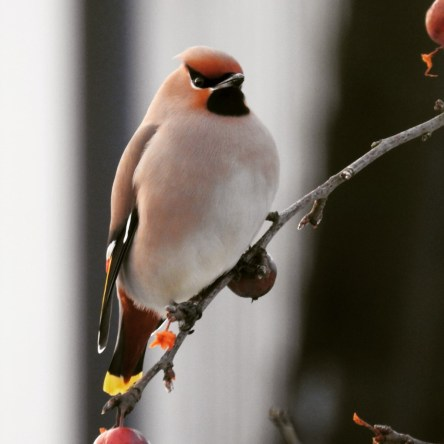

Idag går solen upp 07:43 och ned 16:47. Månen går upp 01:42 och ned 11:01 Månen är belyst 46 %. Dagens längd är 9 timmar och 4 minuter

 Mest molnigt - 3 C  Vindby 0,6 m/s ENE  Luftfuktighet 78 %  hPa 1014 Kl.02:10

 Mest molnigt - 2,7 C  Vindstilla  Luftfuktighet 85 %  hPa 1014 Kl.06:45

 Molnigt 3 C  Vindby 1 m/s N  Luftfuktighet 79 %  hPa 1015 Kl.13:10

 Mest klart - 5,2 C  Vindstilla  Luftfuktighet 87 %  hPa 1016 Kl.19:55

 Idag är gråvädret tilbaka igen.

Högst och lägst uppmätta temperatur igår (inofficiellt privat mätare): Max 4,7 ( i solen ) C , Min – 14,1 C Högst uppmätta vind 2 m/s. Högst uppmätta vindby 3,4 m/s.

Högst och lägst uppmätta temperatur igår (officiellt enligt [YR.NO](http://www.vackertvader.se/v%C3%A4derstation/karlshamn?utm_source=email&utm_medium=email&utm_campaign=asarum)) Max 0,6 C, Min – 13,2 C Högst uppmätta vind 1,5 m/s. Högst uppmätta vindby 3,8 m/s

 Idag fick jag äntligen besök av en sidensvans. Som jag har hoppats på att de skulle hitta hit. Nu får jag bara hoppas att det inte var en engångsföreteelse.
