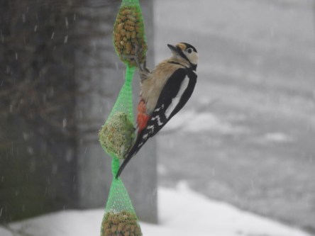
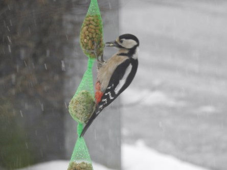
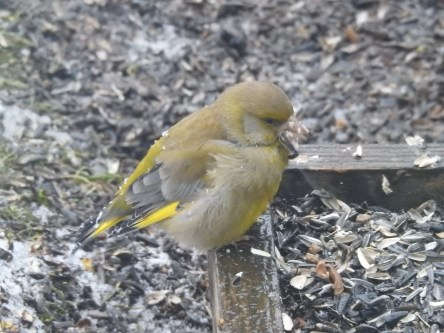

Idag går solen upp 06:35 och ned 17:48. Månen går upp 00:35 och ned 09:29 Månen är belyst 64 %. Dagens längd är 11 timmar och 13 minuter

 Lätt snö - 1 C  Vindby 1,6 m/s NE  Luftfuktighet 87 %  hPa 992 Kl.01:30

 Molnigt - 0,3 C  Vindstilla  Luftfuktighet 95 %  hPa 991 Kl.08:00

 Snöblandat regn 3,3 C  Vindby 1,6 m/s NNW  Luftfuktighet 90 %  hPa 993  Regn/snö 1,7 mm Kl.14:05

 Molnigt - 0,3 C  Vindby 0,6 m/s WSW  Luftfuktighet 95 %  hPa 994  Regn/snö 4 mm Kl.19:50

 Otroligt! Vintern gjorde comeback idag. Nu är allt vitt igen. När ska det ta slut?

Högst och lägst uppmätta temperatur igår (inofficiellt privat mätare): Max 4,9 C , Min – 2,3 C Högst uppmätta vind 4,1 m/s. Högst uppmätta vindby 5,8 m/s.

Högst och lägst uppmätta temperatur igår (officiellt enligt [YR.NO](http://www.vackertvader.se/v%C3%A4derstation/karlshamn?utm_source=email&utm_medium=email&utm_campaign=asarum)) Max 3 C, Min – 1,2 C Högst uppmätta vind 2,9 m/s. Högst uppmätta vindby 7,8 m/s

 Hacke kommer på middag i snöovädret.

 Hungrig grönfink på besök.
